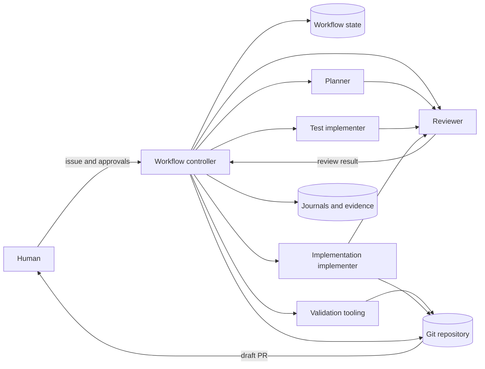
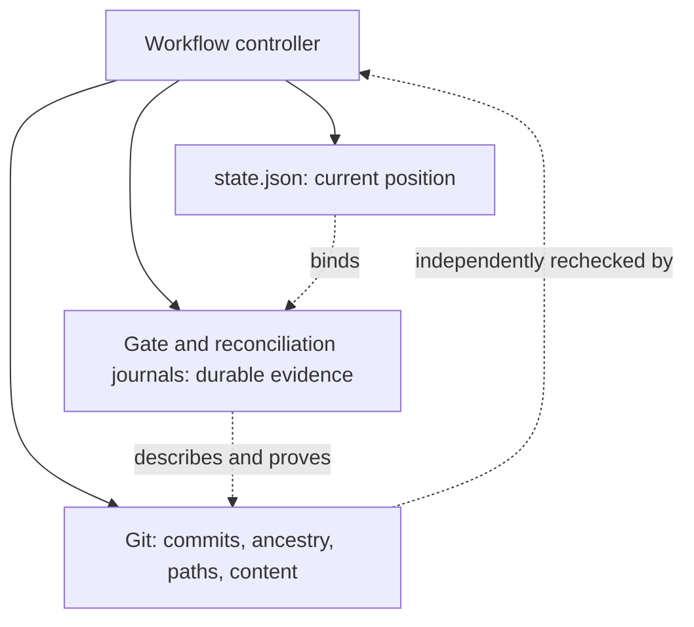
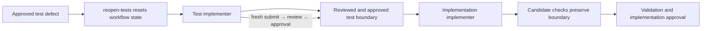
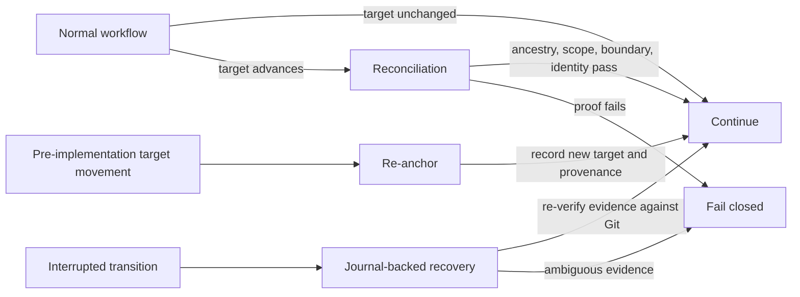
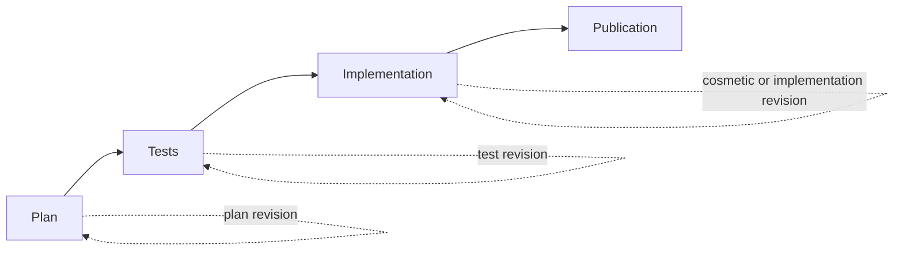

# Governed Agent Workflow Architecture

> **Conceptual overview:** this document explains the architecture and
> governance model at a high level. It does **not** replace the operational
> specification in [`agent-workflow.md`](agent-workflow.md), which defines the
> exact states, commands, evidence, and failure handling.

## Overall workflow

An issue enters a controlled path in which artifacts are produced, reviewed,
and explicitly authorized before the next consequential step. The workflow
ends at draft pull request creation; merging remains a separate,
human-controlled GitHub action.

Conceptually, the stages are: issue and scope → plan → plan review and human
approval → test implementation → test review and human approval →
implementation → implementation review and human approval → validation →
draft PR → human-controlled merge.

## Main actors and components

| Actor or component | Responsibility and boundary |
| --- | --- |
| **Workflow controller** | The repository's CLI coordinator advances only valid transitions, records artifacts, and checks scope and repository invariants. It orchestrates work; it does not replace human approval. |
| **Planner** | Reads the issue and repository context, then proposes the intended paths, behavior, risks, and validation. It does not implement the change. |
| **Test implementer** | Creates the reviewed test boundary first, or records an approved not-applicable rationale when the plan explicitly allows that classification. |
| **Implementation implementer** | Implements only the approved scope against the approved test boundary and supplies validation evidence. |
| **Reviewer** | Performs read-only, incremental review of plans, tests, and implementation artifacts. A ready result opens a human gate; it is not approval itself. |
| **Human** | Approves the three consequential gates and later controls whether the draft PR is merged. The recorded local acknowledgment is a process control, not caller authentication. |
| **Validation and tooling** | Runs configured checks and independently compares the candidate, scope, test boundary, ancestry, and topology against the workflow evidence. |
| **Git and repository** | Provide the independently observable commits, paths, content, ancestry, and pull request history that the controller verifies. |
| **Workflow state** | Records the current transition position and the accepted references needed to continue the run. |
| **Journals and evidence** | Preserve durable transition details and provenance so important transitions can be audited or safely recovered. |

## State, journals, and Git

These sources are complementary, not interchangeable:

`state.json` answers “where is the run now?” The per-gate journals,
including test approval, implementation approval, and implementation-target
reconciliation journals, preserve evidence and provenance for important
transitions and interrupted recovery. Git remains an independent source of
truth for the resulting commit history and content: the controller checks
ancestry, candidate/tree or diff identity, changed paths, and one-commit
topology rather than trusting a copied state value.

## Human approval

Human approval is required at three points:

1. **After plan review:** authorizes the planned scope and unlocks test
   implementation.
2. **After test review:** authorizes the reviewed test boundary (or the
   explicitly approved not-applicable classification) and unlocks
   implementation.
3. **After implementation review and validation:** authorizes creation of the
   authoritative implementation commit and unlocks draft PR creation.

The workflow records who asserted the local acknowledgment and what was
acknowledged, but that record does not authenticate the caller or establish
independent authorization. The exact operational acknowledgment procedure is
documented in [`agent-workflow.md`](agent-workflow.md).

## Test boundary

Tests are intentionally separated from production implementation:

The approved test paths and content are checked again during implementation
submission, validation, and implementation approval. An implementation cannot
silently alter the approved boundary. If an approved test fixture has a
defect, `reopen-tests` only resets workflow state: it clears the test
approval/report/review and recorded test commit, then returns the run to test
implementation. It does **not** correct the defect; the test implementer must
produce the correction through a fresh submit → review → approve cycle, just
as for the initial test submission.

## Recovery and reconciliation

Normal execution is the primary path. When the target branch advances or a
transition is interrupted, the workflow does not simply copy state forward:

Re-anchoring applies before implementation artifacts exist. Candidate
reconciliation handles an accepted but uncommitted candidate after legitimate
target advancement, while implementation-target reconciliation handles the
later committed-candidate case. Each path re-verifies ancestry, scope,
approved tests, candidate identity, and topology against durable evidence.
The detailed recovery commands and preconditions remain in
[`agent-workflow.md`](agent-workflow.md).

## Governed revisions

A completed run's Plan → Tests → Implementation → Publication commitments do
not have to be rebuilt from scratch for a follow-up change. `start-revision`
binds a new run to an eligible completed/published parent run and enters the
workflow at the boundary matching a claimed revision class (`cosmetic`,
`implementation`, `test`, or `plan`), inheriting only the parent's commitments
that remain valid and re-establishing only what is downstream of that
boundary:

The claimed class is a request, not an authorization: mechanical checks over
the parent implementation, approved plan/scope, approved tests, and current
Git content derive the minimum required boundary and reject a narrower claim.
Cosmetic Markdown is restricted to normalized whitespace and Mermaid direction
layout changes; semantic labels, rules, commands, requirements, and behavior
remain significant. No agent or LLM judgment classifies a revision or bypasses
re-establishment of an affected boundary.

On the publication side, `publish-pr-revision` lets such a revision update an
explicitly named, already-open draft PR — re-verifying its live identity,
repository, open/draft state, base, branch, and head immediately before
publishing and pushing with `--force-with-lease` — as a distinct operation
from first-time draft PR creation. The PR is independently re-read after the
push before finalization. `recover-pr-revision` binds the journal to the exact
run and revalidates the complete live PR state, failing closed on any
unexpected divergence. Full
preconditions and failure modes are in
[`agent-workflow.md`](agent-workflow.md#governed-revisions).

## Security and governance boundary

Agents produce plans, tests, implementation candidates, and reports.
Reviewers inspect those artifacts. Humans authorize the transitions that
unlock the next consequential action. Independently observed Git and evidence
checks prevent an agent from making its own work valid merely by declaring it
valid.

Scope, ancestry, test-boundary, content-identity, cleanliness, and topology
violations fail closed. This is a governance and integrity boundary, not a
claim that the local acknowledgment mechanism authenticates a person or
replaces GitHub review, CI, or human-controlled merging.
