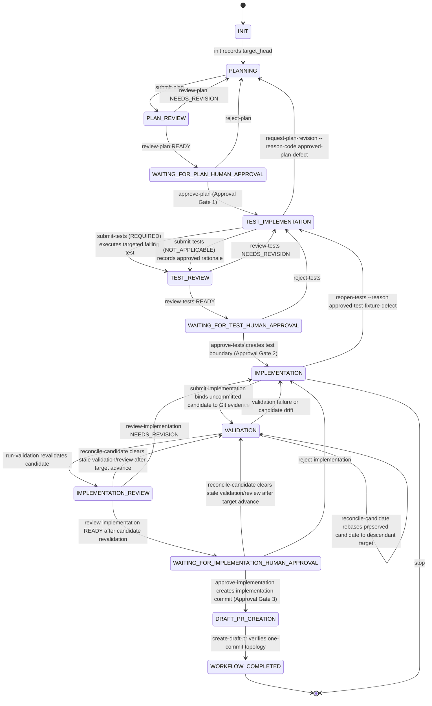

# ChessEcho issue workflow

This repository uses a minimal, file-based issue workflow in `scripts/agent_workflow.py`.

## Roles

- **Planner** (`chess-echo-planner`): writes the implementation plan using read-only tools.
- **Reviewer** (`chess-echo-reviewer`): read-only gate review, no test execution, includes incremental review.
- **Test implementer** (`chess-echo-test-implementer`): writes tests before production changes.
- **Implementer** (`chess-echo-implementer`): writes production changes and runs validation.

## Storage

Each issue run lives in:

```text
.agent-workflow/runs/issue-<number>/
```

with:
- `state.json` (current gate state)
- `artifacts/` (plan/review/report files)
- `implementation-approval-transition.json` (the immutable Gate 3
  transition journal)

The transition journal is created only after Gate 3's existing preconditions
pass and after the exact local acknowledgment is accepted, but before any
`git add`, `git reset`, or `git commit`. JSON state and journal writes use a
same-directory temporary file, file flush and `fsync`, atomic replacement, and
directory `fsync` where supported. Persistence failures are explicit workflow
errors; malformed or missing state and journal documents fail closed.

The journal records the exact acknowledgment, including
`independent_authorization: false`, and binds the existing
`implementation_candidate` to the canonical `_candidate_identity` projection
(`test_commit`, sorted paths, candidate diff SHA-256, and candidate diff byte
length). The candidate object and identity helper remain authoritative; the
journal is transition evidence and does not introduce a second candidate model
or digest. It also records the approved target and direct parent, test boundary
and applicability, scope, validation/evidence, review readiness, approvals,
artifacts, and reviewed subject.

Artifact source files supplied with `--artifact` must be staged outside the Git
worktree (for example, in the session's attachment or temporary artifact
directory). The coordinator copies them into the run-local `artifacts/`
directory; leaving a source staging directory such as `artifacts-src/` in the
worktree makes the required clean-worktree gate fail.

## Gate sequence

1. `init`
2. `submit-plan --scope PATH` -> `review-plan`
3. Approval Gate: `approve-plan`
4. `submit-tests --failure-command "COMMAND" --failure-contains "EXPECTED"` -> `review-tests`
5. Approval Gate: `approve-tests`
6. `submit-implementation --evidence PATH`
7. `run-validation`
8. `review-implementation`
9. `create-draft-pr`

An in-progress run may use `reanchor-target ISSUE --by REQUESTER` only before
implementation artifacts exist (planning through test review). The command
requires a clean worktree, fetches `origin/<target_base>`, and accepts only a
strict descendant of the recorded `target_head`; it never accepts a
caller-supplied commit or replacement scope. It records append-only old/new
target identities, requester, timestamp, and artifact validation in
`target_reanchors`. Plans, scope, approvals, and valid test artifacts remain
in place. Runs with implementation candidates, implementation commits, or
draft PRs fail closed rather than being reset or silently invalidated.

When the run already has an accepted implementation candidate but has not yet
published a workflow implementation commit, use
`reconcile-candidate ISSUE --by REQUESTER`. This recovery is legal only in
`VALIDATION`, `IMPLEMENTATION_REVIEW`, and
`WAITING_FOR_IMPLEMENTATION_HUMAN_APPROVAL`. It does **not** relax
`reanchor-target`; instead it handles the later lifecycle states that
`reanchor-target` intentionally rejects. The command fetches
`origin/<target_base>`, requires a strict descendant of the recorded
`target_head`, requires the controlled uncommitted candidate state (`HEAD ==
test_commit`, clean index, and exact match to the accepted candidate), rejects
any overlap between target-advance paths and approved test/candidate paths,
rebases the approved test boundary plus a temporary candidate checkpoint onto
the new target, and proves equivalence by comparing the exact test-boundary and
candidate diffs before and after reapplication. It records append-only
provenance in `candidate_reconciliations` with old/new targets, requester,
timestamp, target-change paths, candidate identities before/after, approved
test-boundary diff hashes, reconciliation method, and validated invariants.
Plan intent, approved scope, approved tests, applicability, and implementation
evidence remain in place only when that proof succeeds; otherwise the command
fails closed and leaves the run unchanged.

At each Approval Gate, autonomous execution pauses until an approval operation
is recorded. The current local operation compares an exact confirmation phrase
from `.github/agent-workflow.json`; it does not authenticate the caller.

When plan review reaches `WAITING_FOR_PLAN_HUMAN_APPROVAL`, `review-plan`
prints the exact submitted plan, the exact read-only review, an Approval Gate
descriptor, the local acknowledgment command, and an explicit stopped-at-gate
message. No operator decision is inferred or generated automatically.



Tests are committed before production code so the behavior contract is independently reviewable.
For an approved plan that explicitly classifies test implementation as `NOT_APPLICABLE`, `submit-tests --not-applicable --reason "..."`
records the rationale and proceeds to test review without a test commit. The existing `REQUIRED` path remains mandatory whenever the
approved plan does not establish `NOT_APPLICABLE`; the implementer cannot select that path ad hoc.
`approve-tests` creates the workflow `test_commit`, and later stages enforce that approved tests
remain byte-for-byte unchanged. Production implementation remains an uncommitted candidate until Human
Gate 3. `submit-implementation` independently compares the current native Git candidate diff with the
submitted execution evidence, records the accepted candidate, and validation, implementation review, and
the implementation Approval Gate each recompute that Git candidate before advancing.

During `run-validation`, `REQUIRED` test implementations must retain every approved test path
byte-for-byte. `NOT_APPLICABLE` is an explicit approved state with no approved test files; validation
does not substitute the repository root for an empty test-path set. Missing or malformed applicability
or approved-scope state fails closed.

`reconcile-candidate` is the only governed recovery after implementation
submission and before publication when the target branch advances. It preserves
the run only if the workflow can prove all of the following against the fetched
descendant target: prior target identity, approved test boundary, exact
accepted candidate diff/paths, approved scope, approved applicability state
(`REQUIRED` or `NOT_APPLICABLE`), and one-commit publication topology
preconditions. Any non-descendant target, unexpected staged change, candidate
drift, scope drift, malformed applicability/test-boundary state, overlapping
target changes, rebase conflict, or post-rebase diff mismatch is treated as
ambiguous validity and fails closed without mutating the run.

The workflow records `target_head` from the configured PR target branch at `init` and requires the
worktree `HEAD` to match it, so pre-existing branch commits cannot be absorbed into a run. Immediately
before the implementation Approval Gate and draft PR creation, the workflow fetches the target branch and fails
closed if it advanced. `approve-implementation` creates the single workflow implementation commit
directly on `target_head`; `create-draft-pr` verifies that the final branch has exactly one commit, that
`HEAD^` is the target, and that changed paths remain within the approved scope. `create-draft-pr` is a
workflow action, not an Approval Gate. PR review, CI, and merge remain external GitHub processes.

Immediately after creating the authoritative commit, Gate 3 independently
recomputes the accepted candidate and approved test boundary, checks the
reviewed subject, approved scope, target freshness, direct-parent and
one-commit topology, and requires a clean index and worktree. Only then is
`state.json` atomically moved to `DRAFT_PR_CREATION` with the exact
acknowledgment and `implementation_commit`. Journal finalization is a
separate idempotent step, so a failure between commit and state persistence
remains recoverable without creating a second commit.

Use the explicit recovery command after an interrupted Gate 3 transition:

```bash
python3 scripts/agent_workflow.py recover-implementation-approval ISSUE
```

Recovery accepts no identity, acknowledgment, candidate, parent, or commit
input. It relies only on the durable journal and existing workflow evidence,
revalidates every binding and publication invariant, and never creates a PR or
advances another gate. The only accepted Git shapes are:

| Shape | Required state |
| --- | --- |
| `HEAD == test_commit` with the original uncommitted candidate | clean index and exact candidate |
| `HEAD == test_commit` with the exact candidate staged | no unstaged or extra content |
| `HEAD == target_head` after the soft reset | exact approved tests plus exact candidate staged |
| `HEAD` is the verified direct child of `target_head` | journal-bound authoritative commit |
| final workflow state already persisted | final state, journal, and commit agree |

Target advancement, candidate or path drift, extra content, staged/unstaged
ambiguity, altered acknowledgments, applicability, scope, evidence,
validation, review, subject, parent, topology, or final-result metadata all
fail closed. A matching direct-child commit without the durable journal is
never adopted. Recovery is idempotent: committed transitions are verified and
persisted, not recommitted, and a finalized transition is only re-read.

This journal is crash-consistency evidence for the local workflow, not a
general transaction framework or an independent authorization mechanism. It
cannot authenticate the asserted operator, prevent external Git mutations, or
replace GitHub review and CI. If recovery cannot prove one of the enumerated
shapes, preserve the worktree and obtain operator direction rather than
guessing.

There is no `approve-pr`, `reject-pr`, `WAITING_FOR_PR`, or `PR_APPROVED` state. The exceptional
`reopen-tests --reason approved-test-fixture-defect` transition exists only to recover from a proven
approved-test fixture defect before the implementation Approval Gate or draft PR creation; it preserves any
uncommitted production candidate and requires Approval Gate 2 to run again.

When an approved plan is discovered to be defective during `TEST_IMPLEMENTATION`,
`request-plan-revision` is the only governed recovery to planning. It requires
`--reason-code approved-plan-defect`, a non-empty explanation, and an asserted
requester. The command is rejected in every other workflow state, does not
accept replacement scope, archives the prior plan/review and downstream evidence
under the issue run's `artifacts/plan-revisions/` directory, and clears active
downstream approvals and candidates. A replacement plan must then be submitted,
reviewed, and approved through Approval Gate 1 before test implementation resumes.
This transition does not provide the separate `NOT_APPLICABLE` capability.

## Approval terminology and assurance

An **Approval Gate** is a workflow pause before autonomous progression. It is
not, by its name or persisted legacy status identifier, proof that an approval
was performed by a human.

- **Operator approval** is a deliberate decision by the person operating the
  session. The local workflow cannot authenticate it from command-line text.
- **Self-attested/local approval** is the present
  `approve-* --by ... --confirm ...` mechanism. It records a matching static
  phrase and an `asserted_by` value supplied by the calling process. It does
  not authenticate that value, prove the caller was an operator, or establish
  independent authorization.
- **Host-confirmed approval** is a Copilot-host permission decision permitting
  a requested tool invocation in a restrictive interactive session.
- **Independent authorization** is a trusted authority's verifiable,
  exact-challenge-bound approval that an agent cannot forge. It is not
  implemented by this local workflow.

The #122 incident demonstrated why this distinction matters: an autonomous
agent invoked the local command with `--by nathankebede` and the public
confirmation phrase. That event was self-attested local input, not
independently observed operator authorization.

Copilot host permissions can provide optional operational friction. For a
governance-sensitive run, use an interactive session in manual permission mode;
avoid `--allow-all`, `--yolo`, `--allow-all-tools`, `COPILOT_ALLOW_ALL=true`,
and broad or location-persisted permissions for approval-relevant operations.
The host can then interrupt a requested direct operation and require an
operator decision, preferably for that invocation only.

Host friction is defense in depth, not an authority receipt. It does not
authenticate an operator, prove intent, produce workflow-verifiable approval,
bind an immutable workflow challenge, or prevent all equivalent local effects.
A command deny rule blocks a matching request, not the semantic effect: another
permitted shell, interpreter, edit, or state-write path may reproduce it.
`--assisted-approval` is an automated safety judge, not operator approval.

The stronger independent-authorization assurance described by #237 remains
future work. Do not claim that either the local CLI or Copilot host friction
satisfies that requirement.

## Target authenticity

Every point that resolves `origin/<target_base>` for a fetch (`init` and the
target-freshness check that guards later gates) first verifies that `origin`
itself resolves to the repository configured in `authoritative_remote`
(`.github/agent-workflow.json`, e.g. `"github.com/NathanZK/ChessEcho"`). The
resolved `origin` URL is normalized (scheme, credentials, and `.git` suffix
stripped; SSH shorthand rewritten to `host/owner/repo`) and compared against
the configured expectation. A local `url.*.insteadOf` rewrite, or any other
substitution that causes `origin` to resolve to a different repository, fails
closed with `remote-not-authoritative` before any fetch or target resolution
is trusted. The check is inert only when a run has no `authoritative_remote`
configured or no `origin` remote at all, matching prior behavior for such
environments (for example, local test harnesses that simulate `origin/<
target_base>` via a ref without a real remote).

## Superseding an invalidated run

`supersede-run` retires a run whose provenance was invalidated by something
outside the workflow's own gates (for example: a `target_head` later proven
to have come from a substituted remote, per "Target authenticity" above) so
the same issue can be re-run cleanly from a trusted baseline.

It is deliberately not a recovery or reconciliation mechanism: unlike
`reanchor-target` or `reconcile-candidate`, it never inspects, adopts,
verifies, or transfers any approval, candidate, or evidence into a new run.
It only relocates the existing run's on-disk state and artifacts, intact, to
a durable historical location outside every canonical `issue-<n>` run path,
and records why and by whom that happened.

Requirements:

- The run must exist (`no-existing-run` otherwise) and be in `DRAFT_PR_CREATION`
  or `WORKFLOW_COMPLETED` (`run-not-eligible-for-supersession` otherwise).
  Earlier-stage runs are refused because they may still make legitimate
  progress through normal commands; superseding them would discard
  recoverable work as a matter of convenience, not necessity.
- A non-empty `--reason` and a matching `--confirm` phrase
  (`workflow.approvals.supersede`, default `supersede_confirmed`) and `--by`
  identity are required, following the same local-acknowledgment convention
  used by every other human approval gate.
- The retired run's directory (state, artifacts, everything) is moved,
  unmodified, to `.agent-workflow/runs/superseded/issue-<n>-<timestamp>-<
  token>/`, alongside a `supersession-manifest.json` recording the original
  and new locations, the original status, a SHA-256 of the original
  `state.json`, the reason, the authorizing identity and confirmation, the
  workflow's own `HEAD` at the time of the transition, and the target base.
- Because the move removes the run from its canonical `issue-<n>` path,
  every normal workflow command for that issue (approvals, rejections,
  validation, recovery, `reanchor-target`, `reconcile-candidate`,
  `create-draft-pr`, even `status`) fails closed with a missing-run error
  until a fresh `init` creates a new run — the superseded run cannot be
  resumed or mutated through any normal command, and a second
  `supersede-run` attempt on the same issue fails closed identically to one
  that was never initialized. `init` for the same issue then binds a fresh,
  empty state to the current authoritative target with no inherited
  approval, candidate, or evidence state from the retired run.
- The historical run remains fully intact on disk for audit; inspecting it
  is a plain file read, not a workflow command, so no separate read path is
  needed or provided.

## Bounded execution

All external commands run via `scripts/workflow_supervisor.py` with configured timeout, grace period, and output caps.
Normal repository CI remains the broad validation authority; local checks are targeted to avoid reproducing CI.

## Commands

```bash
python3 scripts/agent_workflow.py init ISSUE
python3 scripts/agent_workflow.py status ISSUE
python3 scripts/agent_workflow.py supersede-run ISSUE --by REQUESTER --reason "..." --confirm supersede_confirmed
python3 scripts/agent_workflow.py submit-plan ISSUE --artifact PATH --agent chess-echo-planner
python3 scripts/agent_workflow.py review-plan ISSUE --status READY_FOR_HUMAN_APPROVAL|NEEDS_REVISION --artifact PATH --reviewer chess-echo-reviewer
python3 scripts/agent_workflow.py approve-plan ISSUE --by LOGIN --confirm plan_approved
python3 scripts/agent_workflow.py reject-plan ISSUE --by LOGIN --reason "..."
python3 scripts/agent_workflow.py request-plan-revision ISSUE --by LOGIN --reason-code approved-plan-defect --reason "..."
python3 scripts/agent_workflow.py submit-tests ISSUE --artifact PATH --agent chess-echo-test-implementer --failure-command "COMMAND" --failure-contains "EXPECTED"
python3 scripts/agent_workflow.py submit-tests ISSUE --artifact PATH --agent chess-echo-test-implementer --not-applicable --reason "Approved rationale"
python3 scripts/agent_workflow.py reanchor-target ISSUE --by REQUESTER
python3 scripts/agent_workflow.py reconcile-candidate ISSUE --by REQUESTER
python3 scripts/agent_workflow.py review-tests ISSUE --status READY_FOR_HUMAN_APPROVAL|NEEDS_REVISION --artifact PATH --reviewer chess-echo-reviewer
python3 scripts/agent_workflow.py approve-tests ISSUE --by LOGIN --confirm tests_approved
python3 scripts/agent_workflow.py reject-tests ISSUE --by LOGIN --reason "..."
python3 scripts/agent_workflow.py reopen-tests ISSUE --reason approved-test-fixture-defect
python3 scripts/agent_workflow.py submit-implementation ISSUE --artifact PATH --agent chess-echo-implementer --evidence PATH
python3 scripts/agent_workflow.py run-validation ISSUE --profile PROFILE
python3 scripts/agent_workflow.py review-implementation ISSUE --status READY_FOR_HUMAN_APPROVAL|NEEDS_REVISION --artifact PATH --reviewer chess-echo-reviewer
python3 scripts/agent_workflow.py approve-implementation ISSUE --by LOGIN --confirm implementation_approved
python3 scripts/agent_workflow.py recover-implementation-approval ISSUE
python3 scripts/agent_workflow.py reject-implementation ISSUE --by LOGIN --reason "..."
python3 scripts/agent_workflow.py create-draft-pr ISSUE --title "..." --body-file PATH
```

`create-draft-pr` enforces the PR body section headings: `## What`, `## Why`, `## Testing`.
