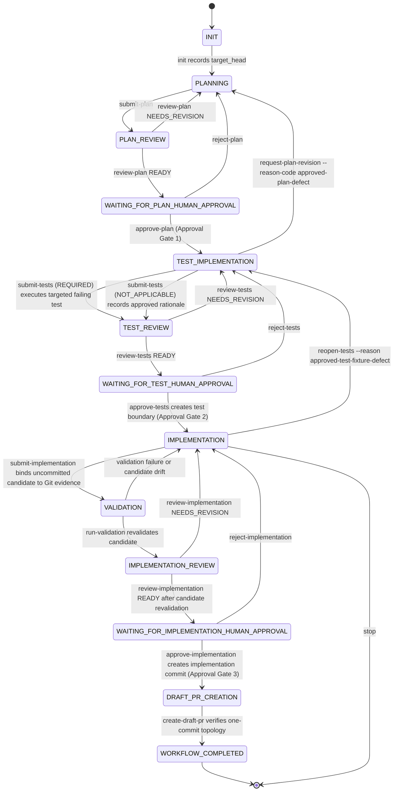

# ChessEcho issue workflow

This repository uses a minimal, file-based issue workflow in `scripts/agent_workflow.py`.

## Roles

- **Planner** (`chess-echo-planner`): writes the implementation plan using read-only tools.
- **Reviewer** (`chess-echo-reviewer`): read-only gate review, no test execution, includes incremental review.
- **Test implementer** (`chess-echo-test-implementer`): writes tests before production changes.
- **Implementer** (`chess-echo-implementer`): writes production changes and runs validation.

## Storage

Each issue run lives in:

```text
.agent-workflow/runs/issue-<number>/
```

with:
- `state.json` (current gate state)
- `artifacts/` (plan/review/report files)

Artifact source files supplied with `--artifact` must be staged outside the Git
worktree (for example, in the session's attachment or temporary artifact
directory). The coordinator copies them into the run-local `artifacts/`
directory; leaving a source staging directory such as `artifacts-src/` in the
worktree makes the required clean-worktree gate fail.

## Gate sequence

1. `init`
2. `submit-plan --scope PATH` -> `review-plan`
3. Approval Gate: `approve-plan`
4. `submit-tests --failure-command "COMMAND" --failure-contains "EXPECTED"` -> `review-tests`
5. Approval Gate: `approve-tests`
6. `submit-implementation --evidence PATH`
7. `run-validation`
8. `review-implementation`
9. `create-draft-pr`

An in-progress run may use `reanchor-target ISSUE --by REQUESTER` only before
implementation artifacts exist (planning through test review). The command
requires a clean worktree, fetches `origin/<target_base>`, and accepts only a
strict descendant of the recorded `target_head`; it never accepts a
caller-supplied commit or replacement scope. It records append-only old/new
target identities, requester, timestamp, and artifact validation in
`target_reanchors`. Plans, scope, approvals, and valid test artifacts remain
in place. Runs with implementation candidates, implementation commits, or
draft PRs fail closed rather than being reset or silently invalidated.

At each Approval Gate, autonomous execution pauses until an approval operation
is recorded. The current local operation compares an exact confirmation phrase
from `.github/agent-workflow.json`; it does not authenticate the caller.

When plan review reaches `WAITING_FOR_PLAN_HUMAN_APPROVAL`, `review-plan`
prints the exact submitted plan, the exact read-only review, an Approval Gate
descriptor, the local acknowledgment command, and an explicit stopped-at-gate
message. No operator decision is inferred or generated automatically.



Tests are committed before production code so the behavior contract is independently reviewable.
For an approved plan that explicitly classifies test implementation as `NOT_APPLICABLE`, `submit-tests --not-applicable --reason "..."`
records the rationale and proceeds to test review without a test commit. The existing `REQUIRED` path remains mandatory whenever the
approved plan does not establish `NOT_APPLICABLE`; the implementer cannot select that path ad hoc.
`approve-tests` creates the workflow `test_commit`, and later stages enforce that approved tests
remain byte-for-byte unchanged. Production implementation remains an uncommitted candidate until Human
Gate 3. `submit-implementation` independently compares the current native Git candidate diff with the
submitted execution evidence, records the accepted candidate, and validation, implementation review, and
the implementation Approval Gate each recompute that Git candidate before advancing.

The workflow records `target_head` from the configured PR target branch at `init` and requires the
worktree `HEAD` to match it, so pre-existing branch commits cannot be absorbed into a run. Immediately
before the implementation Approval Gate and draft PR creation, the workflow fetches the target branch and fails
closed if it advanced. `approve-implementation` creates the single workflow implementation commit
directly on `target_head`; `create-draft-pr` verifies that the final branch has exactly one commit, that
`HEAD^` is the target, and that changed paths remain within the approved scope. `create-draft-pr` is a
workflow action, not an Approval Gate. PR review, CI, and merge remain external GitHub processes.

There is no `approve-pr`, `reject-pr`, `WAITING_FOR_PR`, or `PR_APPROVED` state. The exceptional
`reopen-tests --reason approved-test-fixture-defect` transition exists only to recover from a proven
approved-test fixture defect before the implementation Approval Gate or draft PR creation; it preserves any
uncommitted production candidate and requires Approval Gate 2 to run again.

When an approved plan is discovered to be defective during `TEST_IMPLEMENTATION`,
`request-plan-revision` is the only governed recovery to planning. It requires
`--reason-code approved-plan-defect`, a non-empty explanation, and an asserted
requester. The command is rejected in every other workflow state, does not
accept replacement scope, archives the prior plan/review and downstream evidence
under the issue run's `artifacts/plan-revisions/` directory, and clears active
downstream approvals and candidates. A replacement plan must then be submitted,
reviewed, and approved through Approval Gate 1 before test implementation resumes.
This transition does not provide the separate `NOT_APPLICABLE` capability.

## Approval terminology and assurance

An **Approval Gate** is a workflow pause before autonomous progression. It is
not, by its name or persisted legacy status identifier, proof that an approval
was performed by a human.

- **Operator approval** is a deliberate decision by the person operating the
  session. The local workflow cannot authenticate it from command-line text.
- **Self-attested/local approval** is the present
  `approve-* --by ... --confirm ...` mechanism. It records a matching static
  phrase and an `asserted_by` value supplied by the calling process. It does
  not authenticate that value, prove the caller was an operator, or establish
  independent authorization.
- **Host-confirmed approval** is a Copilot-host permission decision permitting
  a requested tool invocation in a restrictive interactive session.
- **Independent authorization** is a trusted authority's verifiable,
  exact-challenge-bound approval that an agent cannot forge. It is not
  implemented by this local workflow.

The #122 incident demonstrated why this distinction matters: an autonomous
agent invoked the local command with `--by nathankebede` and the public
confirmation phrase. That event was self-attested local input, not
independently observed operator authorization.

Copilot host permissions can provide optional operational friction. For a
governance-sensitive run, use an interactive session in manual permission mode;
avoid `--allow-all`, `--yolo`, `--allow-all-tools`, `COPILOT_ALLOW_ALL=true`,
and broad or location-persisted permissions for approval-relevant operations.
The host can then interrupt a requested direct operation and require an
operator decision, preferably for that invocation only.

Host friction is defense in depth, not an authority receipt. It does not
authenticate an operator, prove intent, produce workflow-verifiable approval,
bind an immutable workflow challenge, or prevent all equivalent local effects.
A command deny rule blocks a matching request, not the semantic effect: another
permitted shell, interpreter, edit, or state-write path may reproduce it.
`--assisted-approval` is an automated safety judge, not operator approval.

The stronger independent-authorization assurance described by #237 remains
future work. Do not claim that either the local CLI or Copilot host friction
satisfies that requirement.

## Bounded execution

All external commands run via `scripts/workflow_supervisor.py` with configured timeout, grace period, and output caps.
Normal repository CI remains the broad validation authority; local checks are targeted to avoid reproducing CI.

## Commands

```bash
python3 scripts/agent_workflow.py init ISSUE
python3 scripts/agent_workflow.py status ISSUE
python3 scripts/agent_workflow.py submit-plan ISSUE --artifact PATH --agent chess-echo-planner
python3 scripts/agent_workflow.py review-plan ISSUE --status READY_FOR_HUMAN_APPROVAL|NEEDS_REVISION --artifact PATH --reviewer chess-echo-reviewer
python3 scripts/agent_workflow.py approve-plan ISSUE --by LOGIN --confirm plan_approved
python3 scripts/agent_workflow.py reject-plan ISSUE --by LOGIN --reason "..."
python3 scripts/agent_workflow.py request-plan-revision ISSUE --by LOGIN --reason-code approved-plan-defect --reason "..."
python3 scripts/agent_workflow.py submit-tests ISSUE --artifact PATH --agent chess-echo-test-implementer --failure-command "COMMAND" --failure-contains "EXPECTED"
python3 scripts/agent_workflow.py submit-tests ISSUE --artifact PATH --agent chess-echo-test-implementer --not-applicable --reason "Approved rationale"
python3 scripts/agent_workflow.py reanchor-target ISSUE --by REQUESTER
python3 scripts/agent_workflow.py review-tests ISSUE --status READY_FOR_HUMAN_APPROVAL|NEEDS_REVISION --artifact PATH --reviewer chess-echo-reviewer
python3 scripts/agent_workflow.py approve-tests ISSUE --by LOGIN --confirm tests_approved
python3 scripts/agent_workflow.py reject-tests ISSUE --by LOGIN --reason "..."
python3 scripts/agent_workflow.py reopen-tests ISSUE --reason approved-test-fixture-defect
python3 scripts/agent_workflow.py submit-implementation ISSUE --artifact PATH --agent chess-echo-implementer --evidence PATH
python3 scripts/agent_workflow.py run-validation ISSUE --profile PROFILE
python3 scripts/agent_workflow.py review-implementation ISSUE --status READY_FOR_HUMAN_APPROVAL|NEEDS_REVISION --artifact PATH --reviewer chess-echo-reviewer
python3 scripts/agent_workflow.py approve-implementation ISSUE --by LOGIN --confirm implementation_approved
python3 scripts/agent_workflow.py reject-implementation ISSUE --by LOGIN --reason "..."
python3 scripts/agent_workflow.py create-draft-pr ISSUE --title "..." --body-file PATH
```

`create-draft-pr` enforces the PR body section headings: `## What`, `## Why`, `## Testing`.
