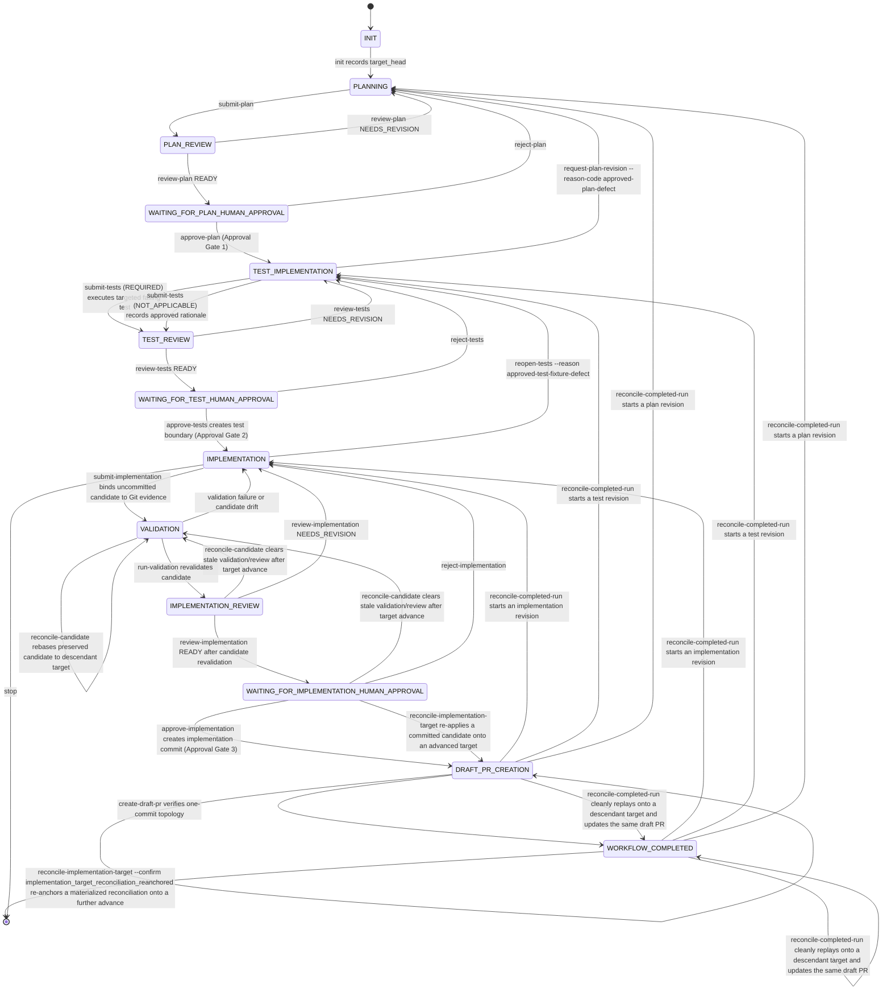

# ChessEcho issue workflow

This repository uses a minimal, file-based issue workflow in `scripts/agent_workflow.py`.

## Issue authoring contract

New product issues should follow
[`.github/ISSUE_TEMPLATE/product-issue.md`](../../.github/ISSUE_TEMPLATE/product-issue.md):
product intent, acceptance criteria, repository constraints (including
deployment/migration state), and validation. See
[`repository-conventions.md`](repository-conventions.md) for the default
pre-deployment assumption and the baseline-first migration convention that
the planner role should apply unless an issue explicitly states otherwise.

## Roles

- **Planner** (`chess-echo-planner`): writes the implementation plan using read-only tools.
- **Reviewer** (`chess-echo-reviewer`): read-only gate review, no test execution, includes incremental review.
- **Test implementer** (`chess-echo-test-implementer`): writes tests before production changes.
- **Implementer** (`chess-echo-implementer`): writes production changes and runs validation.

## Storage

Each issue run lives in:

```text
.agent-workflow/runs/issue-<number>/
```

with:
- `state.json` (current gate state)
- `artifacts/` (plan/review/report files)
- `test-approval-transition.json` (the immutable Gate 2 test-approval
  transition journal)
- `implementation-approval-transition.json` (the immutable Gate 3
  transition journal)
- `implementation-target-reconciliation-transition.json` (the immutable
  post-Gate-3 target-reconciliation transition journal, present only when a
  committed-but-not-persisted implementation approval is reconciled onto an
  advanced target)
- `completed-run-reconciliation-transition.json` (the immutable
  completed-run reconciliation transition journal, present only when an
  already-published completed run is reconciled onto an advanced target or
  escalated into an automatic governed revision)

The transition journals are created only after each gate's existing
preconditions pass and after the exact local acknowledgment is accepted, but
before the workflow-owned `git commit` (and, for Gate 3, before any `git add`
or `git reset`). JSON state and journal writes use a
same-directory temporary file, file flush and `fsync`, atomic replacement, and
directory `fsync` where supported. Persistence failures are explicit workflow
errors; malformed or missing state and journal documents fail closed.

The Gate 3 journal records the exact acknowledgment, including
`independent_authorization: false`, and binds the existing
`implementation_candidate` to the canonical `_candidate_identity` projection
(`test_commit`, sorted paths, canonical per-file candidate diff SHA-256, and
canonical candidate diff byte length). The candidate object and identity helper remain authoritative; the
journal is transition evidence and does not introduce a second candidate model
or digest. It also records the approved target and direct parent, test boundary
and applicability, scope, validation/evidence, review readiness, approvals,
artifacts, and reviewed subject.

The Gate 2 journal records the same class of evidence for the test-approval
transition: the exact acknowledgment, the target and candidate test commit
(also the expected direct parent of the authoritative commit), approved
scope, applicability (`REQUIRED` or `NOT_APPLICABLE`), the reviewed test
paths, existing test failure/report evidence, and any active test-reopening
metadata. It is transition evidence for `approve-tests`, structured the same
way as the Gate 3 journal, so a crash between the workflow-owned empty commit
and state persistence is recoverable without guessing at authorization.

Artifact source files supplied with `--artifact` must be staged outside the Git
worktree (for example, in the session's attachment or temporary artifact
directory). The coordinator copies them into the run-local `artifacts/`
directory; leaving a source staging directory such as `artifacts-src/` in the
worktree makes the required clean-worktree gate fail.

## Gate sequence

1. `init`
2. `submit-plan --scope PATH` -> `review-plan`
3. Approval Gate: `approve-plan`
4. `submit-tests --failure-command "COMMAND" --failure-contains "EXPECTED"` -> `review-tests`
5. Approval Gate: `approve-tests`
6. `submit-implementation --evidence PATH`
7. `run-validation`
8. `review-implementation`
9. `create-draft-pr`

## Invocation modes

The **issue** is the source of truth for *what is being done*. The
**invocation mode** describes *how far the agent is authorized to proceed*;
it does not change the workflow or its gates.

### Self-attested through PR creation

Given an issue number, run the existing sequence autonomously:
`init` → plan review → `approve-plan` → test review → `approve-tests` →
implementation → `run-validation` → implementation review →
`approve-implementation` → `create-draft-pr`. Use the configured local
self-attestation commands at the approval gates, create the PR against
`main`, and stop at PR creation. Do not merge. Local acknowledgments are
self-attested input; they are not authenticated or independently authorized
human approval.

### Human approval required

Given an issue number, run the same governed sequence autonomously through
planning, implementation, review, and validation. When any
`WAITING_FOR_*_HUMAN_APPROVAL` state is reached, stop and wait for explicit
human approval; do not self-attest past that gate. Do not merge.

The repository-level `.github/PULL_REQUEST_TEMPLATE.md` is reusable,
human-facing scaffolding for ordinary pull requests. Its `What`, `Why`, and
`Testing` guidance is intentionally separate from authoritative workflow
evidence: workflow state and artifacts remain the source of truth for approved
intent and scope, test and implementation artifacts, validation results,
approvals, commit/tree/topology identity, PR head identity, and publication or
reconciliation gates. Ordinary authors are not expected to provide those
workflow artifacts in a PR description.

An in-progress run may use `reanchor-target ISSUE --by REQUESTER` only before
implementation artifacts exist (planning through test review). The command
requires a clean worktree, fetches `origin/<target_base>`, and accepts only a
strict descendant of the recorded `target_head`; it never accepts a
caller-supplied commit or replacement scope. It records append-only old/new
target identities, requester, timestamp, and artifact validation in
`target_reanchors`. Plans, scope, approvals, and valid test artifacts remain
in place. Runs with implementation candidates, implementation commits, or
draft PRs fail closed rather than being reset or silently invalidated.

When the run already has an accepted implementation candidate but has not yet
published a workflow implementation commit, use
`reconcile-candidate ISSUE --by REQUESTER`. This recovery is legal only in
`VALIDATION`, `IMPLEMENTATION_REVIEW`, and
`WAITING_FOR_IMPLEMENTATION_HUMAN_APPROVAL`. It does **not** relax
`reanchor-target`; instead it handles the later lifecycle states that
`reanchor-target` intentionally rejects. The command fetches
`origin/<target_base>`, requires a strict descendant of the recorded
`target_head`, requires the controlled uncommitted candidate state (`HEAD ==
test_commit`, clean index, and exact match to the accepted candidate), rejects
any overlap between target-advance paths and approved test/candidate paths,
rebases the approved test boundary plus a temporary candidate checkpoint onto
the new target, and proves equivalence by comparing the exact test-boundary and
candidate diffs before and after reapplication. It records append-only
provenance in `candidate_reconciliations` with old/new targets, requester,
timestamp, target-change paths, candidate identities before/after, approved
test-boundary diff hashes, reconciliation method, and validated invariants.
Plan intent, approved scope, approved tests, applicability, and implementation
evidence remain in place only when that proof succeeds; otherwise the command
fails closed and leaves the run unchanged.

If `reconcile-candidate` correctly fails closed because the advanced target
genuinely overlaps the accepted uncommitted implementation candidate, use the
operator-directed recovery command instead:

```bash
python3 scripts/agent_workflow.py recover-implementation-target ISSUE --by REQUESTER --confirm implementation_target_recovery_confirmed
```

This is an in-place pre-publication recovery for the same run, not a revision
run and not a weakening of `reanchor-target` or `reconcile-candidate`. It is
legal only in `VALIDATION`, `IMPLEMENTATION_REVIEW`, and
`WAITING_FOR_IMPLEMENTATION_HUMAN_APPROVAL`, requires the exact accepted
uncommitted candidate to still be present, resolves `origin/<target_base>` via
the existing target-authenticity checks, and accepts only a strict descendant
of the recorded `target_head`. Before any Git mutation it writes a durable
`implementation-target-recovery-transition.json` journal recording the
requester, acknowledgment, old/new targets, candidate identity, test-boundary
analysis, and every downstream evidence field invalidated by the recovery.

The command never merges or rebases the stale implementation candidate. It
clears `implementation_candidate`, `approvals.implementation`, `validation`,
and `implementation_review_ready`, then returns the run to
`IMPLEMENTATION` so a fresh `submit-implementation` → `run-validation` →
`review-implementation` → `approve-implementation` cycle is required. If the
advanced target also touched approved test paths, the approved test boundary
can no longer be mechanically preserved; the command clears test approval and
`test_commit` as well and returns to `TEST_IMPLEMENTATION`. Ambiguous
ancestry, malformed scope/applicability, candidate drift, dirty index state,
or inability to prove preserved test-boundary equivalence fails closed.

At each Approval Gate, autonomous execution pauses until an approval operation
is recorded. The current local operation compares an exact confirmation phrase
from `.github/agent-workflow.json`; it does not authenticate the caller.

When plan review reaches `WAITING_FOR_PLAN_HUMAN_APPROVAL`, `review-plan`
prints the exact submitted plan, the exact read-only review, an Approval Gate
descriptor, the local acknowledgment command, and an explicit stopped-at-gate
message. No operator decision is inferred or generated automatically.



Tests are committed before production code so the behavior contract is independently reviewable.
For an approved plan that explicitly classifies test implementation as `NOT_APPLICABLE`, `submit-tests --not-applicable --reason "..."`
records the rationale and proceeds to test review without a test commit. The existing `REQUIRED` path remains mandatory whenever the
approved plan does not establish `NOT_APPLICABLE`; the implementer cannot select that path ad hoc.
`approve-tests` creates the workflow `test_commit`, and later stages enforce that approved tests
remain byte-for-byte unchanged. Production implementation remains an uncommitted candidate until Human
Gate 3. Candidate diff equivalence and its identity canonicalize exact
per-file diff sections by their `diff --git` path headers, so tracked and
new-file section serialization order does not matter while content, path, and
mode differences still fail closed. `submit-implementation` records the accepted candidate's path set and a canonical Git tree
identity (`candidate_tree`, computed from an empty scratch index populated only with the candidate's own
changed paths, independent of unrelated base-tree drift). Validation, implementation review, and the
implementation Approval Gate each recompute the current path set and tree identity and require an exact
match against the accepted candidate before advancing; this authoritative content/mode/path equivalence
check replaced an earlier raw-diff-byte comparison that was fragile to tracked/untracked diff
serialization ordering.

During `run-validation`, `REQUIRED` test implementations must retain every approved test path
byte-for-byte. `NOT_APPLICABLE` is an explicit approved state with no approved test files; validation
does not substitute the repository root for an empty test-path set. Missing or malformed applicability
or approved-scope state fails closed.

`reconcile-candidate` is the governed recovery for an accepted *uncommitted*
candidate after implementation submission and before publication when the
target branch advances. It preserves the run only if the workflow can prove all
of the following against the fetched descendant target: prior target identity,
approved test boundary, exact accepted candidate path set and tree identity,
approved scope, approved applicability state (`REQUIRED` or `NOT_APPLICABLE`),
and one-commit publication topology preconditions. Any non-descendant target,
unexpected staged change, candidate drift, scope drift, malformed
applicability/test-boundary state, overlapping target changes, rebase conflict,
or post-rebase diff mismatch is treated as ambiguous validity and fails closed
without mutating the run. The distinct post-Gate-3 case — a
committed-but-not-persisted authoritative commit whose target has since
advanced — is handled only by `reconcile-implementation-target` (see
[Reconciling a committed Gate 3 candidate onto an advanced target](#reconciling-a-committed-gate-3-candidate-onto-an-advanced-target)),
never by `reconcile-candidate` or `recover-implementation-approval`.

The workflow records `target_head` from the configured PR target branch at `init` and requires the
worktree `HEAD` to match it, so pre-existing branch commits cannot be absorbed into a run. Immediately
before the implementation Approval Gate and draft PR creation, the workflow fetches the target branch and fails
closed if it advanced. `approve-implementation` creates the single workflow implementation commit
directly on `target_head`; `create-draft-pr` verifies that the final branch has exactly one commit, that
`HEAD^` is the target, and that changed paths remain within the approved scope. `create-draft-pr` is a
workflow action, not an Approval Gate. PR review, CI, and merge remain external GitHub processes.

### Target drift condition and decision model

Target drift is a first-class workflow condition: the authoritative target is
a strict descendant of the run's recorded `target_head`. Detecting drift does
not by itself invalidate approved product intent, but it always makes the
recorded repository realization stale until the workflow proves how the
target delta affects that intent. Existing target-authenticity, ancestry,
scope, candidate-identity, evidence-provenance, authorization, and clean-tree
checks remain mandatory.

The approved evidence has two separate dimensions. **Product intent** is the
behavioral outcome authorized by the issue and plan; **repository realization**
is the target, paths, tests, candidate, and other concrete assumptions used to
implement that outcome. A target change may invalidate the realization while
preserving intent. It may invalidate intent only when the plan or scope must
change, and that case always enters a governed plan revision. Historical
artifacts and approvals remain bound to their exact recorded content; neither
dimension is inferred from a changed filename or silently rewritten.

Every successful target-drift transition records a canonical `target_drift`
object in its append-only provenance or transition journal:

| Field | Meaning |
| --- | --- |
| `condition` | Always `target-drift`. |
| `product_intent` | `preserved` when the approved plan remains valid; `invalidated` when the target delta requires plan/scope reconsideration. |
| `repository_realization` | `stale` when exact evidence can be mechanically replayed; `invalidated` when the affected implementation or test realization must be rebuilt. |
| `disposition` | The deterministic next action: `reanchor`, `reconcile`, `reenter-implementation`, `reenter-tests`, or `start-revision`. |
| `transition` | The workflow command that made and recorded the decision. |
| `revision_class` | The smallest affected governed boundary (`implementation`, `test`, or `plan`), or `null` for safe mechanical reconciliation. |

The decision path is deterministic:

| Proven target effect | Intent | Realization | Governed disposition |
| --- | --- | --- | --- |
| Pre-implementation evidence is unchanged | preserved | stale | `reanchor-target` |
| Approved tests and candidate replay exactly with no overlap | preserved | stale | `reconcile-candidate`, `reconcile-implementation-target`, or clean `reconcile-completed-run` |
| In-scope production overlap invalidates the implementation | preserved | invalidated | `recover-implementation-target` re-enters implementation, or completed work starts an `implementation` revision |
| Approved test overlap or replay validation failure invalidates tests | preserved | invalidated | re-enter tests or start a `test` revision |
| Out-of-scope conflict changes the approved plan/scope assumptions | invalidated | invalidated | start a `plan` revision |
| Evidence, ancestry, target identity, or classification is ambiguous | undetermined | undetermined | fail closed without changing state |

Safe reconciliation never rewrites historical approvals or silently blesses
new content: it reuses them only after exact equivalence is proved and records
the transition. Invalidated realization clears the affected downstream
evidence and returns to the smallest required gate. Invalidated product intent
always requires a governed plan revision; no reconciliation command may
silently continue the old plan. Supersession remains retirement for invalid
run provenance, not a target-drift shortcut.

Immediately after creating the authoritative commit, Gate 3 independently
recomputes the accepted candidate and approved test boundary, checks the
reviewed subject, approved scope, target freshness, direct-parent and
one-commit topology, and requires a clean index and worktree. Only then is
`state.json` atomically moved to `DRAFT_PR_CREATION` with the exact
acknowledgment and `implementation_commit`. Journal finalization is a
separate idempotent step, so a failure between commit and state persistence
remains recoverable without creating a second commit.

Use the explicit recovery command after an interrupted Gate 3 transition:

```bash
python3 scripts/agent_workflow.py recover-implementation-approval ISSUE
```

Recovery accepts no identity, acknowledgment, candidate, parent, or commit
input. It relies only on the durable journal and existing workflow evidence,
revalidates every binding and publication invariant, and never creates a PR or
advances another gate. The only accepted Git shapes are:

| Shape | Required state |
| --- | --- |
| `HEAD == test_commit` with the original uncommitted candidate | clean index and exact candidate |
| `HEAD == test_commit` with the exact candidate staged | no unstaged or extra content |
| `HEAD == target_head` after the soft reset | exact approved tests plus exact candidate staged |
| `HEAD` is the verified direct child of `target_head` | journal-bound authoritative commit |
| final workflow state already persisted | final state, journal, and commit agree |

Target advancement, candidate or path drift, extra content, staged/unstaged
ambiguity, altered acknowledgments, applicability, scope, evidence,
validation, review, subject, parent, topology, or final-result metadata all
fail closed. A matching direct-child commit without the durable journal is
never adopted. Recovery is idempotent: committed transitions are verified and
persisted, not recommitted, and a finalized transition is only re-read.

This journal is crash-consistency evidence for the local workflow, not a
general transaction framework or an independent authorization mechanism. It
cannot authenticate the asserted operator, prevent external Git mutations, or
replace GitHub review and CI. If recovery cannot prove one of the enumerated
shapes, preserve the worktree and obtain operator direction rather than
guessing.

### Reconciling a committed Gate 3 candidate onto an advanced target

`recover-implementation-approval` deliberately fails closed once the target
has advanced past the interrupted candidate: it never reconciles a moved
target, and `reconcile-candidate` only handles an accepted *uncommitted*
candidate (`HEAD == test_commit`), not the committed authoritative commit.
For the narrow post-Gate-3 shape where the implementation-approval journal is
either `committed-but-not-persisted` (with a recorded `authoritative_commit`)
or `pending` (with `authoritative_commit: null`), `HEAD` is independently
verifiable as the exact interrupted candidate commit (one direct child of the
journal target), and `origin/<target_base>` has since advanced to a strict
descendant of that journal target, use the explicit governed command:

```bash
python3 scripts/agent_workflow.py reconcile-implementation-target ISSUE --by REQUESTER --confirm implementation_target_reconciled
```

This is a distinct governed transition, not a reuse of the recovery,
`reanchor-target`, or `reconcile-candidate` paths. It requires its own
explicit authorization (`implementation_target_reconciled`) and never mutates
or adopts the old commit. Preconditions, all revalidated before any Git
mutation, are: the implementation-approval journal (pending or
committed-but-not-persisted) with unchanged authorization and approved
boundary; the journal target is an ancestor of, and a strict descendant
relationship holds to, the freshly resolved origin target; the interrupted
candidate commit is proven exact and direct-child journal topology (from the
journaled authoritative commit for committed journals, or independently from
current `HEAD` for pending journals); the approved test boundary and accepted
candidate identity/tree/content/path are unchanged (issue #282 equivalence);
and the worktree is clean.

It then writes an atomic, `fsync`-backed reconciliation journal
(`implementation-target-reconciliation-transition.json`) that preserves the
old and new targets, the old candidate commit, the bound candidate identity,
test boundary, both the source Gate 3 acknowledgment and the reconciliation
acknowledgment, topology proofs, and status/timestamps — before any Git
mutation. It applies the exact journaled approved test boundary and production
candidate as binary patches onto the advanced target, requiring clean
three-way application (a conflicting downstream change to a candidate path
fails closed; unrelated surrounding changes do not), with no automatic
conflict resolution. It creates exactly one new implementation commit directly
on the advanced target, independently proves that commit realizes the
journal-bound candidate and boundary with a single direct-child topology,
reviewed subject, in-scope production-only paths, and a clean worktree, and
only then atomically advances `state.json` to `DRAFT_PR_CREATION` (recording
`implementation_commit`, the new `target_head`, and a
`implementation_target_reconciliations` provenance entry).

Reconciliation is crash-safe and idempotent: the pending journal is written
before the commit, so a crash before the commit retries into exactly one new
commit; the reconciled commit is durably recorded before final state
persistence, so a crash after the commit verifies and persists the existing
commit instead of creating a second one; and re-invoking after success is a
pure verified no-op. A tampered pending or committed reconciliation journal,
an incorrect confirmation phrase, a drifted `HEAD`, a non-descendant or
non-advanced target, candidate/test-boundary tampering, or an unclean
application all fail closed without advancing workflow state. Like the other
journals it is crash-consistency evidence, not independent authorization, and
never creates a PR or advances another gate.

#### Re-anchoring a reconciliation after a further target advance

`reconcile-implementation-target`'s base confirmation
(`implementation_target_reconciled`) only ever reconciles the *original*
interrupted candidate once. If `origin/<target_base>` advances again after a
reconciliation has already been materialized (its journal is `pending` with
`HEAD` moved past the candidate, `pending` still at the candidate, or already
`committed`/`finalized`) but before `create-draft-pr` has run, the existing
reconciliation journal's own `new_target_head` is now stale, and neither the
base confirmation nor any other command re-targets it. This is the shape a
reconciliation itself can be interrupted or overtaken in — for example when a
downstream defect (such as issue #293's verification bug) causes
`_verify_reconciled_implementation` to fail after the reconciliation commit
was already materialized but before the journal or `state.json` recorded it
as `committed`.

The same command accepts a second, distinct confirmation phrase for exactly
this case:

```bash
python3 scripts/agent_workflow.py reconcile-implementation-target ISSUE --by REQUESTER --confirm implementation_target_reconciliation_reanchored
```

This re-anchor transition requires an existing reconciliation journal (any of
the shapes above) and independently re-verifies it against its own recorded
`new_target_head` first — proving no tampering occurred before ever
considering a further advance. It then resolves the current re-anchor
evidence commit: the recorded `reconciled_commit` for a `committed`/
`finalized` journal, the current `HEAD` for a `pending` journal whose
materialize step already ran (the exact issue #276 discovery shape), or the
interrupted candidate commit for a `pending` journal that never materialized.
It fetches and resolves a fresh target, requires it to be a strict descendant
of the journal's current `new_target_head` (`target-not-advanced` and
`invalid-git-ancestry` fail closed otherwise), and appends a new pending entry
to the journal's `reanchors` list — an ordered array of
`{"from_reconciled_commit", "to_target_head", "status", ...}` hops, each
progressing `pending` -> `committed` -> `finalized` — before any further Git
mutation, so a crash at any point retries or resumes exactly that hop.

It then re-applies the same journal-bound approved test boundary and
production candidate onto the fresh target exactly as the base transition
does, with one refinement: if the fresh target already contains that exact
approved content (a pure fast-forward descendant of the prior evidence
commit), no duplicate implementation commit is created — the empty diff is
detected and, when a commit is still required to advance `HEAD`, made with
`git commit --allow-empty` — and the scope proof accepts this trivial
rebase-equivalent shape as a subset of, rather than requiring exact equality
with, the approved paths. Per-path content equivalence against the original
approved evidence is still proven unconditionally regardless of which mode
applies, and no out-of-scope path is ever tolerated. On success it updates the
reconciliation journal's top-level `new_target_head`, `expected_parent`, and
`reconciled_commit`, marks the `reanchors` entry `committed` then
`finalized`, and only then atomically advances `state.json` to
`DRAFT_PR_CREATION` exactly as the base transition would — reusing the same
single `implementation_target_reconciliations` provenance entry rather than
appending a second one, since the state only ever transitions into
`DRAFT_PR_CREATION` once regardless of how many re-anchor hops preceded it.

Re-anchoring is crash-safe and idempotent across any number of chained hops:
a crash before the re-anchor commit retries into exactly one new commit; a
crash after the commit but before finalization independently re-verifies and
persists the existing commit instead of creating a second one; and
re-invoking after success is a pure verified no-op. An unadvanced or
non-descendant fresh target, a tampered reconciliation journal, an incorrect
confirmation phrase, or candidate/test-boundary/path drift all fail closed
without mutating Git or advancing workflow state, identically to the base
transition.


The journal is written to `test-approval-transition.json` after the existing
`approve-tests` preconditions pass (approved-test-only scope, ancestry, exact
`test_commit` boundary, clean index) and before the workflow-owned
`git commit --allow-empty -m "workflow: approve tests"`. Use the explicit
recovery command after an interrupted Gate 2 transition:

```bash
python3 scripts/agent_workflow.py recover-test-approval ISSUE
```

Recovery accepts no identity, acknowledgment, or commit input. It relies only
on the durable journal and existing workflow evidence, revalidates every
binding, and never advances another gate. The only accepted Git shapes are:

| Shape | Required state |
| --- | --- |
| `HEAD == candidate_test_commit` (or `target_head` for `NOT_APPLICABLE`) | clean index and, for `REQUIRED`, no uncommitted test changes |
| `HEAD` is the verified direct child of `candidate_test_commit` | journal-bound authoritative empty commit |
| final workflow state already persisted | final state, journal, and commit agree |

Target advancement, candidate/path drift, altered acknowledgments,
applicability, scope, test-boundary, failure/report evidence, reopening
metadata, subject, parent, or topology all fail closed; recovery never infers
authorization from Git topology alone -- a same-parent commit that changes
any file content, or that lacks the durable journal, is rejected rather than
adopted. Recovery is idempotent: committed transitions are verified and
persisted (updating `test_commit`, `approvals.tests`, and any active
`test_reopenings` entry exactly as `approve-tests` would), not
recommitted, and a finalized transition is only re-read. Both `REQUIRED` and
`NOT_APPLICABLE` applicability are supported; the journal binds an empty
`test_paths` list for `NOT_APPLICABLE`.

There is no `approve-pr`, `reject-pr`, `WAITING_FOR_PR`, or `PR_APPROVED` state. The exceptional
`reopen-tests --reason approved-test-fixture-defect` transition exists only to recover from a proven
approved-test fixture defect before the implementation Approval Gate or draft PR creation; it preserves any
uncommitted production candidate and requires Approval Gate 2 to run again.

When an approved plan is discovered to be defective during `TEST_IMPLEMENTATION`,
`request-plan-revision` is the only governed recovery to planning. It requires
`--reason-code approved-plan-defect`, a non-empty explanation, and an asserted
requester. The command is rejected in every other workflow state, does not
accept replacement scope, archives the prior plan/review and downstream evidence
under the issue run's `artifacts/plan-revisions/` directory, and clears active
downstream approvals and candidates. A replacement plan must then be submitted,
reviewed, and approved through Approval Gate 1 before test implementation resumes.
This transition does not provide the separate `NOT_APPLICABLE` capability.

## Approval terminology and assurance

An **Approval Gate** is a workflow pause before autonomous progression. It is
not, by its name or persisted legacy status identifier, proof that an approval
was performed by a human.

- **Operator approval** is a deliberate decision by the person operating the
  session. The local workflow cannot authenticate it from command-line text.
- **Self-attested/local approval** is the present
  `approve-* --by ... --confirm ...` mechanism. It records a matching static
  phrase and an `asserted_by` value supplied by the calling process. It does
  not authenticate that value, prove the caller was an operator, or establish
  independent authorization.
- **Host-confirmed approval** is a Copilot-host permission decision permitting
  a requested tool invocation in a restrictive interactive session.
- **Independent authorization** is a trusted authority's verifiable,
  exact-challenge-bound approval that an agent cannot forge. It is not
  implemented by this local workflow.

The #122 incident demonstrated why this distinction matters: an autonomous
agent invoked the local command with `--by nathankebede` and the public
confirmation phrase. That event was self-attested local input, not
independently observed operator authorization.

Copilot host permissions can provide optional operational friction. For a
governance-sensitive run, use an interactive session in manual permission mode;
avoid `--allow-all`, `--yolo`, `--allow-all-tools`, `COPILOT_ALLOW_ALL=true`,
and broad or location-persisted permissions for approval-relevant operations.
The host can then interrupt a requested direct operation and require an
operator decision, preferably for that invocation only.

Host friction is defense in depth, not an authority receipt. It does not
authenticate an operator, prove intent, produce workflow-verifiable approval,
bind an immutable workflow challenge, or prevent all equivalent local effects.
A command deny rule blocks a matching request, not the semantic effect: another
permitted shell, interpreter, edit, or state-write path may reproduce it.
`--assisted-approval` is an automated safety judge, not operator approval.

The stronger independent-authorization assurance described by #237 remains
future work. Do not claim that either the local CLI or Copilot host friction
satisfies that requirement.

## Target authenticity

Every point that resolves `origin/<target_base>` for a fetch (`init` and the
target-freshness check that guards later gates) first verifies that `origin`
itself resolves to the repository configured in `authoritative_remote`
(`.github/agent-workflow.json`, e.g. `"github.com/NathanZK/ChessEcho"`). The
resolved `origin` URL is normalized (scheme, credentials, and `.git` suffix
stripped; SSH shorthand rewritten to `host/owner/repo`) and compared against
the configured expectation. A local `url.*.insteadOf` rewrite, or any other
substitution that causes `origin` to resolve to a different repository, fails
closed with `remote-not-authoritative` before any fetch or target resolution
is trusted. The check is inert only when a run has no `authoritative_remote`
configured or no `origin` remote at all, matching prior behavior for such
environments (for example, local test harnesses that simulate `origin/<
target_base>` via a ref without a real remote).

## Superseding an invalidated run

`supersede-run` retires a run whose provenance was invalidated by something
outside the workflow's own gates (for example: a `target_head` later proven
to have come from a substituted remote, per "Target authenticity" above) so
the same issue can be re-run cleanly from a trusted baseline.

It is deliberately not a recovery or reconciliation mechanism: unlike
`reanchor-target` or `reconcile-candidate`, it never inspects, adopts,
verifies, or transfers any approval, candidate, or evidence into a new run.
It only relocates the existing run's on-disk state and artifacts, intact, to
a durable historical location outside every canonical `issue-<n>` run path,
and records why and by whom that happened.

Requirements:

- The run must exist (`no-existing-run` otherwise) and be in `DRAFT_PR_CREATION`
  or `WORKFLOW_COMPLETED` (`run-not-eligible-for-supersession` otherwise).
  Earlier-stage runs are refused because they may still make legitimate
  progress through normal commands; superseding them would discard
  recoverable work as a matter of convenience, not necessity.
- A non-empty `--reason` and a matching `--confirm` phrase
  (`workflow.approvals.supersede`, default `supersede_confirmed`) and `--by`
  identity are required, following the same local-acknowledgment convention
  used by every other human approval gate.
- The retired run's directory (state, artifacts, everything) is moved,
  unmodified, to `.agent-workflow/runs/superseded/issue-<n>-<timestamp>-<
  token>/`, alongside a `supersession-manifest.json` recording the original
  and new locations, the original status, a SHA-256 of the original
  `state.json`, the reason, the authorizing identity and confirmation, the
  workflow's own `HEAD` at the time of the transition, and the target base.
- Because the move removes the run from its canonical `issue-<n>` path,
  every normal workflow command for that issue (approvals, rejections,
  validation, recovery, `reanchor-target`, `reconcile-candidate`,
  `create-draft-pr`, even `status`) fails closed with a missing-run error
  until a fresh `init` creates a new run — the superseded run cannot be
  resumed or mutated through any normal command, and a second
  `supersede-run` attempt on the same issue fails closed identically to one
  that was never initialized. `init` for the same issue then binds a fresh,
  empty state to the current authoritative target with no inherited
  approval, candidate, or evidence state from the retired run.
- The historical run remains fully intact on disk for audit; inspecting it
  is a plain file read, not a workflow command, so no separate read path is
  needed or provided.

## Governed revisions

`start-revision` creates a new run for `ISSUE` that is bound to an existing,
eligible parent run (`--parent-issue`) instead of starting from scratch. It
exists so that a change requested after review — a wording fix, a follow-up
implementation tweak, a test correction, or a genuine plan/scope change — only
re-establishes the governance commitments actually affected, instead of
mechanically rerunning the entire Plan → Tests → Implementation → Publication
sequence.

```bash
python3 scripts/agent_workflow.py start-revision ISSUE --parent-issue PARENT_ISSUE --class cosmetic|implementation|test|plan --by REQUESTER
```

Eligibility and inheritance rules:

- The parent run must exist, be in `DRAFT_PR_CREATION` or
  `WORKFLOW_COMPLETED` (the same statuses `supersede-run` accepts), and have
  an authoritative `implementation_commit` (`parent-run-not-eligible` /
  `parent-run-missing-implementation-commit` otherwise). A run that never
  reached an authoritative implementation has nothing settled to revise
  incrementally.
- `--class test` additionally requires the parent's tests to have been
  `REQUIRED` (not `NOT_APPLICABLE`) — there is no test boundary to correct
  otherwise.
- `ISSUE` must not already have a run, and HEAD must already be at the
  current authoritative `target_head` (the same starting condition as
  `init`).
- Every revision class **inherits the parent's approved plan and approved
  scope by exact content** — never re-typed, never re-approved from
  scratch — and enters the workflow at the class's entry boundary:
  - `cosmetic` and `implementation` enter directly at `IMPLEMENTATION`,
    inheriting the parent's approved test boundary as well as its plan.
  - `test` enters at `TEST_IMPLEMENTATION`, inheriting only the approved
    plan; the test boundary must be re-established.
  - `plan` enters at `PLANNING`; nothing downstream is inherited.
- For `cosmetic`/`implementation` revisions, the parent's approved test
  boundary cannot be reused by SHA (the parent's `test_commit` is a sibling
  of the parent's squashed `implementation_commit`, not an ancestor of the
  new target). Instead, `start-revision` independently verifies — via a real
  `git diff` against the current target — that the approved test file
  content is byte-identical to what was approved, and only then treats the
  current target itself as the (trivially satisfied) inherited test
  boundary. Any drift fails closed with `inherited-test-content-drift`
  rather than silently trusting stale test content.
- The claimed `--class` is only a request, not a bypass:
  `submit-implementation` independently derives the narrowest required
  boundary from the parent implementation, approved scope/plan identity,
  approved test paths, and current Git content. Claims narrower than that
  boundary fail closed with `revision-class-mismatch`; broader claims remain
  safe because they re-establish more downstream commitments.
- A cosmetic Markdown revision is deliberately narrow. The current
  deterministic classifier permits whitespace-only changes and Mermaid
  direction changes (`LR`, `TB`, etc.) while requiring all semantic Markdown,
  including node/edge labels, workflow rules, commands, security requirements,
  acceptance criteria, and architecture behavior, to remain byte-equivalent
  after normalization. Merely using a `.md` suffix is never sufficient.

## PR revisions

`publish-pr-revision` is the publication-side counterpart to `start-revision`:
it lets a freshly governed revision update an **explicitly named, already
open** draft PR instead of creating a new one. It is a distinct, separate
operation from `create-draft-pr` — `create-draft-pr` never updates an
existing PR, and `publish-pr-revision` never creates a new one.

```bash
python3 scripts/agent_workflow.py publish-pr-revision ISSUE --target-pr NUMBER --by REQUESTER --confirm pr_revision_confirmed
python3 scripts/agent_workflow.py recover-pr-revision ISSUE
```

- Only runs created via `start-revision` are eligible
  (`not-a-revision-run` otherwise), and the parent run must have a recorded
  draft PR identity (repository, number, branch, head OID) captured by
  `create-draft-pr` or a prior `publish-pr-revision`.
- `--target-pr` must match that recorded identity exactly
  (`pr-identity-mismatch`); nothing about which PR is updated is inferred.
- Immediately before publishing, the PR's live state is independently
  re-fetched via `gh pr view` and re-verified against every recorded
  expectation: repository and number must match, it must still be `OPEN` and
  a draft, target the configured base branch, keep the same head branch name,
  and — critically — still be at the exact head commit recorded when the
  parent PR identity was captured. Any divergence fails closed instead of
  overwriting unexpected remote state.
- The update is published with `git push --force-with-lease`, bound to the
  exact previously-observed head, so a concurrent push that this run did not
  see is rejected by Git itself rather than silently clobbered.
- The operation is journaled (`chess-echo-pr-revision-transition-v1`) before
  the push. After the leased push, the workflow independently re-reads the PR
  and re-verifies its repository, number, open/draft state, base, branch, and
  resulting head before finalizing. A post-push mismatch leaves the pending
  journal intact for governed recovery.
- `recover-pr-revision` first binds the journal back to the exact child run,
  parent PR, expected old head, and approved new implementation. It then
  revalidates the complete live PR identity/state. Only a fully matching
  post-push head is finalized; the exact pre-push head is retryable, and every
  other state fails closed rather than guessing whether publication occurred.

## Reconciling a completed run onto an advanced target

Once a run has already published a draft PR and later `main` advances, the
problem is no longer an uncommitted candidate or an interrupted Gate 3 commit.
The workflow provides a distinct governed command for that published shape:

```bash
python3 scripts/agent_workflow.py reconcile-completed-run ISSUE --by REQUESTER --confirm completed_run_reconciled
```

Preconditions:

- the run must already exist and be in `DRAFT_PR_CREATION` or
  `WORKFLOW_COMPLETED`
- it must have a recorded `implementation_commit`
- it must have the same recorded draft PR identity required by
  `publish-pr-revision` (`repository`, `number`, `head_ref_name`,
  `head_ref_oid`)
- it must have a previously passing recorded validation profile
- the newly fetched authoritative target must be a **strict descendant** of the
  run's recorded `target_head`; otherwise the command fails closed with
  `target-not-advanced` or the same ancestry failure used by the other
  reconciliation commands

The command reconstructs the approved evidence from the completed run itself:
the approved test boundary, the production-only implementation delta recovered
from the authoritative `implementation_commit`, the approved scope, the reviewed
commit subject, the recorded validation profile, and the recorded PR identity.
It never asks the agent to supply a patch, a path list, or a manual revision id.

Replay is always performed in a workflow-owned scratch worktree under the run
directory, never in the caller's live checkout. The workflow applies the
approved test boundary and recovered production delta with the same three-way
patch style used by `reconcile-implementation-target`, runs the already
recorded validation profile's setup and checks against that isolated tree (see
"Validation setup" below), and always removes the scratch worktree afterward
whether the replay succeeds, conflicts, fails setup, or fails validation.

Deterministic outcomes:

- **Clean replay + setup succeeds (or is not configured) + recorded validation
  passes**: the workflow proves per-path content equivalence against the
  original approved `implementation_commit`, creates exactly one new commit
  directly on the advanced target, and updates the **same** draft PR via `git
  push --force-with-lease` bound to the previously observed head. The
  existing PR number, repository, and branch are preserved; no duplicate PR is
  created and no child revision run is opened.
- **Replay clean + setup succeeds + recorded validation fails**: the workflow
  deterministically opens a governed `test` revision using the existing
  revision machinery with an automatically allocated workflow-local child
  issue id.
- **Replay clean + setup fails**: the workflow fails closed with
  `validation-setup-failed` and leaves the reconciliation journal `pending`
  for retry. This is a validation-environment/setup failure, not a
  deterministic TEST-boundary result, so it is never classified as a `test`
  revision and never escalates any other revision class.
- **Replay conflicts only on in-scope non-test paths**: the workflow
  deterministically opens a governed `implementation` revision.
- **Replay conflicts include any out-of-scope path**: the workflow
  deterministically opens a governed `plan` revision.
- **Ambiguous evidence** (tampered run/journal/PR identity, dirty state, empty
  conflict evidence for a failed apply, inability to prove equivalence, or any
  unsupported partial shape) fails closed without mutating the completed run or
  draft PR.

### Validation setup

A fresh Git worktree — whether the normal workflow worktree used by
`run-validation` or the isolated scratch worktree used by
`reconcile-completed-run` — contains only tracked files. It does not carry
ignored or generated dependencies (for example `frontend/node_modules`), so a
validation profile whose checks assume those dependencies exist (`npm run
lint`, `npx tsc --noEmit`, `npm run test`, `npm run build`) can fail for
environment reasons that have nothing to do with the approved implementation.

A validation profile in `.github/agent-workflow.json` may declare an optional
`setup` list, using the same `{"name", "command", "cwd"}` shape as `checks`.
When present, setup commands run once, in order, before any check, always
rooted at the worktree supplied to that validation run (never at any other
worktree), and stop at the first failing step. The `frontend` and
`full-stack` profiles configure `npm ci --no-audit --no-fund` with `cwd
frontend` as their setup step, matching the repository's existing dependency
install contract.

Both `run-validation` and `reconcile-completed-run` execute setup through the
same shared implementation before running checks, so the contract and its
failure semantics are identical in both call paths:

- If a profile has no `setup` entries, behavior is unchanged and fully
  backward compatible.
- If setup succeeds (or is absent), checks run exactly as before and their
  pass/fail result is the only input to TEST-boundary classification.
- If setup fails, or required tooling remains unavailable after setup
  completes, the run fails closed as a **validation-environment/setup
  failure** (`validation-setup-failed`). Checks are not executed. This is
  never conflated with a check (test) failure: `run-validation` returns the
  run to `IMPLEMENTATION` for a corrected resubmission, and
  `reconcile-completed-run` leaves its transition journal `pending` for retry
  instead of opening a `test` revision.

Persisted validation evidence (`state["validation"]` and the completed-run
reconciliation journal) records `setup` (the per-step results, or `null` when
no setup is configured), `setup_passed`, and `checks` (`null` when setup
failed and checks never ran) so audits can distinguish a setup/environment
failure from an actual check/test failure.

### Configuration provenance for reconciliation

`reconcile-completed-run` replays historical, already-approved evidence (the
approved test boundary, the recovered production delta, the approved scope,
the reviewed commit subject, and the recorded validation profile *name*), but
the *executable* validation profile definitions — the `setup` and `checks`
commands that a profile actually runs — must reflect what the authoritative
reconciliation target currently declares in `.github/agent-workflow.json`,
never whatever happens to be checked out in the caller's live worktree. A
caller checkout can lag the authoritative target (for example, it may predate
a change that added a required `setup` step for a profile), and running
validation with that stale configuration can silently skip environment
provisioning the authoritative target now requires, producing a misleading
check failure instead of an accurate result.

To avoid this, after the workflow creates its isolated scratch worktree at
the newly resolved, strict-descendant authoritative target (see
[Reconciling a completed run onto an advanced target](#reconciling-a-completed-run-onto-an-advanced-target)),
it re-loads and re-validates `.github/agent-workflow.json` from that scratch
worktree — the same schema validation applied to the caller's own
configuration at startup — before running that profile's setup or checks.
Only this freshly obtained and verified authoritative configuration is used
to execute the recorded validation profile; the caller's original
configuration is never substituted, and there is no fallback path to it. If
the authoritative configuration cannot be loaded, fails schema validation, or
no longer declares the recorded validation profile, the command fails closed
with `authoritative-config-unverifiable` and leaves the reconciliation
journal `pending` for retry, exactly like a `validation-setup-failed` outcome.
This never mutates the completed run or its draft PR, and it is distinct from
governance state such as roles, approvals, and command execution limits,
which remain bound to the run's own recorded configuration and are
unaffected. Historical run evidence itself is never rewritten by this check.

### Completed-run reconciliation journal

Before any Git mutation, the workflow writes
`completed-run-reconciliation-transition.json` using the same crash-safe
same-directory temp-file + `fsync` + atomic replace + directory `fsync`
pattern as the other transition journals. The document uses the
`chess-echo-completed-run-reconciliation-transition-v1` format and advances
`pending` -> `committed` -> `finalized`.

The journal binds the run identity, the old and new targets, the old approved
implementation commit, the approved test boundary, the recovered production
candidate and canonical candidate identity, the reused validation profile, the
recorded draft PR identity, the exact local acknowledgment
(`completed_run_reconciled`), and either:

- the successful reconciliation result (`reconciled_commit`), or
- the deterministic revision escalation result (`revision_issue`,
  `revision_class`, conflict paths, and validation evidence)

It also records `setup` (the setup step results from that attempt, or `null`)
and `validation` (the check results, or `null` when setup failed) so a setup
failure is distinguishable from a check failure in the persisted evidence. A
setup failure leaves the journal `status` at `pending` rather than advancing
it to `committed`/`finalized`, so the next `reconcile-completed-run` invocation
retries reconciliation from scratch.

Like every other workflow journal, it is crash-consistency evidence for the
local workflow only. It does not independently authenticate the asserted
operator, and any mismatch between the journal, Git state, or live PR state
fails closed instead of being repaired heuristically.

### Recovering a superseded false revision classification

A finalized completed-run reconciliation journal is ordinarily terminal.
`reconcile-completed-run` returns its recorded result rather than rerunning
the replay because the journal is immutable evidence of a completed governed
transition; allowing an arbitrary retry could silently replace a revision
decision and its audit trail.

The separate recovery command is available only for the narrow infrastructure
false-classification shape:

```bash
python3 scripts/agent_workflow.py recover-completed-run-reconciliation ISSUE --by REQUESTER --confirm completed_run_recovery_confirmed
```

It never edits or deletes the original finalized journal. It requires that
the original journal records a finalized `test` revision whose immutable
validation output contains an unavailable-tool failure (`command not found`
or `no such file or directory`), with no failed setup step; that its
auto-created child revision is still at its original `TEST_IMPLEMENTATION`
entry state with no approvals, tests, candidate, validation, implementation,
or publication progress; and that the authoritative target has advanced
strictly beyond the original replay target and now declares a non-empty setup
for the recorded validation profile. Every malformed, incomplete, progressed,
ordinary-test-failure, unchanged-target, or configuration-ambiguous shape
fails closed.

Recovery writes a new immutable recovery transition journal that binds the
digest of the old journal, the old child revision identity, the later target,
and both self-attested acknowledgments. It then runs the same completed-run
source reconstruction, scratch replay, authoritative configuration loading,
setup, validation, equivalence verification, PR lease, and revision
classifier as `reconcile-completed-run`; it does not inherit the old child
revision's approvals, artifacts, validation evidence, or implementation
state. Genuine test, implementation, and plan revisions remain governed by
their own `start-revision` workflow and are not recoverable by this command.

## Bounded execution

All external commands run via `scripts/workflow_supervisor.py` with configured timeout, grace period, and output caps.
Normal repository CI remains the broad validation authority; local checks are targeted to avoid reproducing CI.

## Commands

```bash
python3 scripts/agent_workflow.py init ISSUE
python3 scripts/agent_workflow.py status ISSUE
python3 scripts/agent_workflow.py supersede-run ISSUE --by REQUESTER --reason "..." --confirm supersede_confirmed
python3 scripts/agent_workflow.py submit-plan ISSUE --artifact PATH --agent chess-echo-planner
python3 scripts/agent_workflow.py review-plan ISSUE --status READY_FOR_HUMAN_APPROVAL|NEEDS_REVISION --artifact PATH --reviewer chess-echo-reviewer
python3 scripts/agent_workflow.py approve-plan ISSUE --by LOGIN --confirm plan_approved
python3 scripts/agent_workflow.py reject-plan ISSUE --by LOGIN --reason "..."
python3 scripts/agent_workflow.py request-plan-revision ISSUE --by LOGIN --reason-code approved-plan-defect --reason "..."
python3 scripts/agent_workflow.py submit-tests ISSUE --artifact PATH --agent chess-echo-test-implementer --failure-command "COMMAND" --failure-contains "EXPECTED"
python3 scripts/agent_workflow.py submit-tests ISSUE --artifact PATH --agent chess-echo-test-implementer --not-applicable --reason "Approved rationale"
python3 scripts/agent_workflow.py reanchor-target ISSUE --by REQUESTER
python3 scripts/agent_workflow.py reconcile-candidate ISSUE --by REQUESTER
python3 scripts/agent_workflow.py review-tests ISSUE --status READY_FOR_HUMAN_APPROVAL|NEEDS_REVISION --artifact PATH --reviewer chess-echo-reviewer
python3 scripts/agent_workflow.py approve-tests ISSUE --by LOGIN --confirm tests_approved
python3 scripts/agent_workflow.py recover-test-approval ISSUE
python3 scripts/agent_workflow.py reject-tests ISSUE --by LOGIN --reason "..."
python3 scripts/agent_workflow.py reopen-tests ISSUE --reason approved-test-fixture-defect
python3 scripts/agent_workflow.py submit-implementation ISSUE --artifact PATH --agent chess-echo-implementer --evidence PATH
python3 scripts/agent_workflow.py run-validation ISSUE --profile PROFILE
python3 scripts/agent_workflow.py review-implementation ISSUE --status READY_FOR_HUMAN_APPROVAL|NEEDS_REVISION --artifact PATH --reviewer chess-echo-reviewer
python3 scripts/agent_workflow.py approve-implementation ISSUE --by LOGIN --confirm implementation_approved
python3 scripts/agent_workflow.py recover-implementation-approval ISSUE
python3 scripts/agent_workflow.py reconcile-implementation-target ISSUE --by REQUESTER --confirm implementation_target_reconciled
python3 scripts/agent_workflow.py reconcile-implementation-target ISSUE --by REQUESTER --confirm implementation_target_reconciliation_reanchored
python3 scripts/agent_workflow.py reconcile-completed-run ISSUE --by REQUESTER --confirm completed_run_reconciled
python3 scripts/agent_workflow.py recover-completed-run-reconciliation ISSUE --by REQUESTER --confirm completed_run_recovery_confirmed
python3 scripts/agent_workflow.py reject-implementation ISSUE --by LOGIN --reason "..."
python3 scripts/agent_workflow.py create-draft-pr ISSUE --title "..." --body-file PATH
python3 scripts/agent_workflow.py start-revision ISSUE --parent-issue PARENT_ISSUE --class cosmetic|implementation|test|plan --by REQUESTER
python3 scripts/agent_workflow.py publish-pr-revision ISSUE --target-pr NUMBER --by REQUESTER --confirm pr_revision_confirmed
python3 scripts/agent_workflow.py recover-pr-revision ISSUE
```

`create-draft-pr` enforces the governed PR body section headings exactly:
`## What`, `## Why`, `## Testing`. This executable contract is independent of
the reusable repository template and must not be relaxed or replaced by
template guidance. The template's optional related-issue, scope,
migration/deployment, screenshot, and UI notes are author-facing guidance only;
they are not additional universal requirements.
