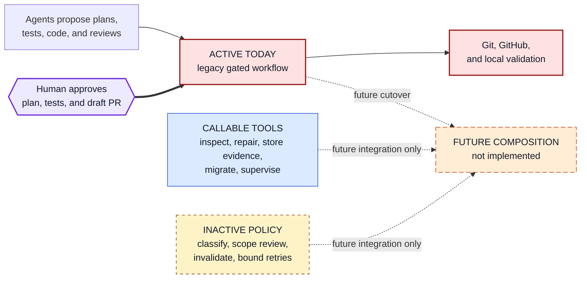

# Planner -> Reviewer -> Implementer Workflow

ChessEcho uses a repository-scoped, resumable workflow for taking a GitHub issue
through planning, tests, implementation, validation, and a draft pull request.
The currently active lifecycle is still the legacy
`scripts/agent_workflow.py` path. New trusted primitives and policy evaluators
exist beside it, but they are not a replacement lifecycle and are not activated
by the legacy CLI.

This guide is the canonical end-to-end orientation and operating procedure.
Focused engineering documents remain the detailed contracts for individual
trusted mechanisms and policies.

## Why the architecture exists

The workflow coordinates processes and state with different failure modes:

- agents are unreliable workers whose prose and artifacts are candidates, not
  authority;
- repository, branch, worktree, base-ref, and GitHub PR state can change between
  observations;
- commands can fail, time out, be interrupted, or leave uncertain external
  outcomes;
- review and human approval apply to exact evidence, not to a mutable filename
  or a similar-looking later result;
- retry and reopen loops can preserve useful work, but can also repeat forever
  or reuse stale evidence unless dependencies and limits are explicit;
- filesystem replacement can be atomic for one name without making a set of
  files a transaction or guaranteeing storage durability on every filesystem;
  and
- a workflow tool that modifies and certifies itself can amplify ambiguity in
  its own implementation.

Ordinary mutable files, process exit zero, implicit agent success, or one large
state-machine script are insufficient because none independently proves that the
observed bytes, repository revision, review, approval, and intended transition
still belong together. ChessEcho therefore separates:

1. the active legacy lifecycle and its human gates;
2. narrow trusted primitives for inspection, repair, canonical evidence,
   migration, and process supervision;
3. deterministic but inactive policy evaluators; and
4. a future thin composition/activation responsibility owned by
   [issue #144](https://github.com/NathanZK/ChessEcho/issues/144).

## A simple mental model

The system is easier to understand as four layers:

1. **What runs today:** one legacy command-line workflow owns lifecycle state,
   invokes the agent roles, enforces human gates, runs validation, and creates a
   draft pull request.
2. **Trusted callable components:** smaller tools can independently inspect,
   repair, store verified evidence, migrate supported records, or supervise a
   process. The active workflow does not call them yet.
3. **Inactive policy evaluators:** deterministic modules can classify work,
   scope plan review, invalidate dependent evidence, and bound retries. They
   return results but cannot change lifecycle state.
4. **Future composition:** a future thin orchestrator, tracked in
   [issue #144](https://github.com/NathanZK/ChessEcho/issues/144), must connect
   these pieces and retire the legacy authority without running both as active
   state machines.



## What runs today

For a normal implementation issue, the active workflow is:

```text
issue
  -> plan -> independent review -> human plan approval
  -> tests -> independent review -> human test approval
  -> implementation -> local validation -> final review
  -> draft pull request -> human PR approval record
```

The Orchestrator drives `scripts/agent_workflow.py`; the Planner writes the plan;
the Implementer first acts as Test Author and later writes production code; the
Reviewer independently reviews each stage; and a human authorizes the three
gates. The CLI persists local run state, binds validation and review to exact Git
revisions, and reconciles the draft PR. It records final PR approval but does not
merge or mark the PR ready.

Today, `agent_workflow.py` imports only `workflow_kernel.py`. It does **not**
activate the newer evidence, migration, repair, work-type, plan-review, or
dependency-policy components described later.

## Core terms

These definitions are the minimum needed to read the detailed architecture. The
[Glossary](#glossary) later provides a broader operational reference.

| Term | Meaning |
|---|---|
| **Active lifecycle** | The supported state transitions and human gates executed by `agent_workflow.py` and persisted with `workflow_kernel.py`. |
| **Implemented and independently callable** | A landed primitive or CLI can be invoked directly, but is not integrated into the active legacy lifecycle. |
| **Inactive policy** | A landed, directly invocable evaluator can verify inputs and emit a derived result, but cannot publish or activate lifecycle authority. |
| **Trusted primitive** | A narrow implementation is trusted only for its documented mechanism. This does not authenticate its caller or make caller-selected input authoritative. |
| **Untrusted candidate** | Agent output, inline documents, process output, or a caller-designated digest before the owning verifier establishes its exact contract. |
| **Trusted/designated digest** | An expected byte identity supplied out of band. The receiving component proves equality, not who selected it, whether it is latest, or whether it has been revoked. |
| **Authority** | Exact state selected by the active authority mechanism. A digest, fingerprint, checkpoint, review, or process result alone is never authority. |
| **Activation boundary** | The point where a separately authorized operation would make verified evidence or a policy result affect lifecycle authority. None of the inactive policies can cross it. |
| **Evidence** | Exact bytes and structured records used to support a workflow decision, such as a plan, review, test report, validation result, or repository observation. |
| **Content-addressed storage (CAS)** | Storage whose object name is derived from a digest of its bytes. Identical bytes share an identity; the digest does not identify an approved producer. |
| **Manifest** | Canonical list of evidence paths, file kinds, modes, sizes, and payload references. It answers “what bytes make up this evidence?” |
| **Provenance** | Separate record of how, when, and from where evidence was captured. |
| **Lineage** | Parent relationship showing whether evidence is original, inherited unchanged, or a replacement. |
| **Evidence binding** | Immutable graph root that connects one decision and subject to a manifest, provenance, lineage, and optional migration metadata. It is not the same as pinning a workflow to a Git revision. |
| **Git revision pinning** | Recording the exact base and `HEAD` commits used for validation, review, and PR creation so later Git movement cannot silently reuse stale evidence. |
| **Projection** | Materialized state/history files or a derived view of canonical records. Whether a projection is authoritative depends on the owning component. |
| **Trust anchor** | An expected current identity obtained independently of the data being evaluated. A policy can verify equality to it but cannot choose it for itself. |
| **Invalidation** | Removing evidence from the active dependency set because something it depends on changed, while retaining the old immutable record for audit. |
| **Convergence** | Bounded progression from identifying a cause through applying and verifying a fix; retry exhaustion escalates instead of looping forever. |
| **Run formats v1-v4** | Successive stored formats of the legacy local workflow. Version 4 is the current legacy format and adds the committed state/history integrity envelope; these are not versions of the newer trusted components. |
| **Protocol immutability** | Public CAS writers never overwrite conflicting bytes and readers recheck object identity. It is not tamper-proof storage against an actor with filesystem write access. |
| **Historical evidence** | Public issues, PRs, commits, historical source, and postmortem observations used to explain evolution. They do not govern a current run. |

## Architecture

### End-to-end view

Use this diagram as a reference: trace the thick red path for today's lifecycle,
solid arrows into blue boxes for implemented component calls, dotted arrows for
inactive derived policy, and open-circle arrows only for future composition.

```mermaid
flowchart TB
  subgraph Evolution["Historical pressure and response - context, never authority"]
    E99["PR #99<br/>initial gated lifecycle"] --- E79["#79 work-shape mismatch<br/>#85 terminal correction"]
    E79 --- E120["#117 correction runs<br/>#120 bounded validation + integrity"]
    E120 --- E115["#115 failed monolithic<br/>evidence attempt - FROZEN"]
    E115 --- ECore["#128-#134<br/>trusted-core decomposition"]
    ECore --- EPolicy["#116 + #125<br/>inactive policy layers"]
    EPolicy --- E126["#126<br/>architecture consolidation"]
    E126 --- E144["#144 future<br/>composition + activation"]
  end

  subgraph Roles["People and unreliable workers"]
    Human{{"Human authorization"}}
    Orchestrator["Orchestrator"]
    Planner["Planner"]
    Reviewer["Reviewer"]
    Implementer["Implementer<br/>(Test Author during TEST_IMPLEMENTATION)"]
  end

  subgraph Legacy["ACTIVE TODAY - legacy lifecycle authority"]
    LegacyCLI["agent_workflow.py<br/>lifecycle, gates, corrections,<br/>validation, Git/GitHub"]
    Plan["PLANNING ⇄ PLAN_REVIEW"]
    PlanGate{{"WAITING_FOR_PLAN_<br/>HUMAN_APPROVAL"}}
    Tests["TEST_IMPLEMENTATION ⇄ TEST_REVIEW<br/>Implementer acts as Test Author"]
    TestGate{{"WAITING_FOR_TEST_<br/>HUMAN_APPROVAL"}}
    Impl["IMPLEMENTATION → VALIDATION"]
    Final["FINAL_REVIEW"]
    Draft["DRAFT_PR_CREATED"]
    PRGate{{"WAITING_FOR_PR_<br/>HUMAN_APPROVAL"}}
    Approved["PR_APPROVED"]
    Reopen["explicit reject / reopen<br/>clears dependent evidence"]
    CorrectionFork["start-correction<br/>immutable parent + child"]
    CorrMeta["metadata-only → PR gate<br/>inherits all except PR approval"]
    CorrImpl["implementation-only → IMPLEMENTATION<br/>inherits approved plan + tests"]
    CorrTest["test-contract → TEST_IMPLEMENTATION<br/>inherits approved plan"]
    CorrArch["architecture → PLANNING<br/>inherits nothing"]
    Kernel["workflow_kernel.py<br/>legacy v4 serialization,<br/>integrity, lock, per-file replace"]
    LegacyFiles[("worktree run projections<br/>state / history / integrity<br/>artifacts / validation logs")]
    External["Git + GitHub + configured<br/>local validation subprocesses"]
  end

  subgraph Trusted["IMPLEMENTED - independently callable trusted substrate"]
    Inspector["workflow_inspector.py<br/>read-only verification + checkpoint"]
    Repair["workflow_repair.py<br/>explicit bundle + journaled repair"]
    CAS["workflow_cas.py<br/>protocol-immutable publication"]
    Evidence["workflow_evidence.py<br/>manifest + provenance + lineage + binding"]
    Migration["workflow_migration.py<br/>deterministic conversion + publication"]
    Supervisor["workflow_supervisor.py<br/>bounded process-group execution"]
    Durable[("durable pointer / index / CAS<br/>under Git common directory")]
  end

  subgraph Policies["DIRECTLY CALLABLE BUT INACTIVE - derived results only"]
    P134["Dependency / convergence policy<br/>(issue #134; inactive)"]
    Invalidation["minimal dependency closure<br/>max 2 root-changing cycles<br/>then decomposition-required"]
    Convergence["UNKNOWN → CAUSE → FIX → APPLIED<br/>→ TARGETED_VERIFIED → CLOSED<br/>max 3 retries per stage<br/>then human-recovery-required"]
    P116["Work-type policy<br/>(issue #116; inactive)"]
    Triage["exact work-type-triage evidence binding<br/>external publication/designation required<br/>not active authority"]
    P125["Plan-revision policy<br/>(issue #125; inactive)"]
  end

  Future["#144 THIN ORCHESTRATOR<br/>NOT IMPLEMENTED / NOT ACTIVE"]

  Orchestrator -->|"active command dispatch"| LegacyCLI
  Planner -->|"candidate plan"| Plan
  Reviewer -->|"technical reviews"| Plan
  Reviewer --> Tests
  Reviewer --> Final
  Implementer -->|"tests before production"| Tests
  Implementer -->|"implementation + validation"| Impl
  Human ==>|"approve / reject plan"| PlanGate
  Human ==>|"approve / reject tests"| TestGate
  Human ==>|"approve / reject PR"| PRGate
  Human ==>|"authorize reopen / correction"| Reopen
  Human ==> CorrectionFork

  LegacyCLI ==> Plan
  Plan ==>|"Reviewer ready"| PlanGate
  PlanGate ==>|"approved"| Tests
  Tests ==>|"Reviewer ready"| TestGate
  TestGate ==>|"approved"| Impl
  Impl ==>|"validation passes"| Final
  Final ==>|"Reviewer ready"| Draft
  Draft ==> PRGate
  PRGate ==>|"approved"| Approved
  Reopen ==>|"plan change"| Plan
  Reopen ==>|"test-contract change"| Tests
  Reopen ==>|"implementation change"| Impl

  PRGate ==> CorrectionFork
  Approved ==> CorrectionFork
  CorrectionFork ==> CorrMeta
  CorrectionFork ==> CorrImpl
  CorrectionFork ==> CorrTest
  CorrectionFork ==> CorrArch
  CorrMeta ==> PRGate
  CorrImpl ==> Impl
  CorrTest ==> Tests
  CorrArch ==> Plan

  LegacyCLI --> Kernel
  Kernel -->|"envelope-last projection writes"| LegacyFiles
  LegacyCLI --> External

  Inspector -->|"read only"| Durable
  Inspector -->|"repeated repository observations"| External
  Repair -->|"checkpoint + exact preconditions"| Inspector
  Repair --> CAS
  Repair -->|"pointer replace is repair commit point"| Durable
  Evidence --> CAS
  Evidence -->|"binding published last"| Durable
  Migration --> Inspector
  Migration --> Kernel
  Migration --> Evidence
  CAS --> Durable
  P134 --> Inspector
  P134 --> Evidence
  P134 --> Migration
  P116 --> Inspector
  P116 --> Evidence
  P116 --> Supervisor
  P125 --> Inspector
  P125 --> Evidence

  P134 -.-> Invalidation
  P134 -.-> Convergence
  P116 -.->|"derived result relationship;<br/>does not publish"| Triage
  Triage -.->|"plan policy checks generic identity<br/>and subject links only"| P125

  P134 --o Future
  P116 --o Future
  P125 --o Future
  Human --o Future
  LegacyCLI --o Future
  Future --o Inspector
  Future --o Repair
  Future --o Evidence
  Future --o Migration
  Future --o Supervisor

  ECore --- Inspector
  EPolicy --- P116

  subgraph Legend["Legend"]
    LH1["history"] --- LH2["history: chronology/context only"]
    LA1["active"] ==>|"thick: active lifecycle transition"| LA2["active"]
    LT1["implemented"] -->|"solid arrow: direct call/read/write"| LT2["implemented"]
    LI1["inactive"] -.->|"dotted: derived, not authority"| LI2["inactive"]
    LF1["future"] --o LF2["open-circle: future obligation only"]
  end

  classDef historical fill:#f3f4f6,stroke:#6b7280,color:#111827;
  classDef active fill:#fee2e2,stroke:#991b1b,color:#111827,stroke-width:2px;
  classDef trusted fill:#dbeafe,stroke:#1d4ed8,color:#111827;
  classDef inactive fill:#fef3c7,stroke:#92400e,color:#111827,stroke-dasharray:5 5;
  classDef future fill:#ffedd5,stroke:#c2410c,color:#111827,stroke-dasharray:8 4;
  classDef human fill:#ede9fe,stroke:#6d28d9,color:#111827,stroke-width:2px;
  classDef store fill:#dcfce7,stroke:#166534,color:#111827;
  class E99,E79,E120,E115,ECore,EPolicy,E126,E144,LH1,LH2 historical;
  class LegacyCLI,Plan,Tests,Impl,Final,Draft,Approved,Reopen,CorrectionFork,CorrMeta,CorrImpl,CorrTest,CorrArch,Kernel,LegacyFiles,External,LA1,LA2 active;
  class Inspector,Repair,CAS,Evidence,Migration,Supervisor,Durable,LT1,LT2 trusted;
  class P134,Invalidation,Convergence,P116,Triage,P125,LI1,LI2 inactive;
  class Future,LF1,LF2 future;
  class Human,PlanGate,TestGate,PRGate human;
  class LegacyFiles,Durable store;
```



### What the arrows mean

| Flow | Meaning and limit |
|---|---|
| Historical `---` ribbon | Chronology and motivation only. A line from historical pressure to a landed component is not a runtime dependency or authority edge. |
| Thick active lifecycle arrows | Currently enforced transitions, approval gates, reopen paths, and correction entry routes in `agent_workflow.py`. |
| Roles -> legacy CLI | Agents produce candidate artifacts in the state allowed for their role. Reviewer readiness is technical evidence, not human authorization. The Human arrow is distinct because only explicit human commands cross approval gates. |
| Legacy CLI -> kernel -> projections | The legacy CLI owns lifecycle meaning. The kernel supplies canonical bytes, integrity checks, advisory locks, and atomic replacement of each projection file. State, history, and integrity are not replaced as one filesystem transaction; the integrity envelope is written last as the commit marker and recovery handles supported interruptions. |
| Legacy CLI -> Git/GitHub/validation | The active path observes and mutates external state directly and runs configured validation with `subprocess.run`. It does not use the new supervisor and its captured output is not size-bounded. |
| Inspector -> durable store/Git | The inspector independently verifies supported durable authority and repeats mutable Git observations before emitting a checkpoint. A checkpoint is a deterministic observation and possible precondition, not approval or permanent freshness. |
| Repair -> inspector/CAS/pointer | `prepare` and `dry-run` are read-only; explicit `apply`/`recover` use a canonical bundle, advisory repair lock, journal, immutable object publication, source recheck, and one pointer replacement commit point. Non-cooperating legacy writers must be quiescent. |
| Evidence -> CAS -> binding | Payloads, semantic manifest, and provenance are published before the binding. Binding-last prevents a successful partial graph, but an interruption may leave unreachable objects. |
| Migration -> inspector/kernel/evidence | Migration accepts enumerated exact source bytes or a durable checkpoint selection, rebuilds a deterministic plan, rechecks durable preconditions, and publishes evidence. It does not activate a lifecycle, pointer, or policy. |
| Dotted policy edges | Dependency/convergence evaluation and the work-type-triage/plan-context relationship are derived checks only. The plan policy validates the triage binding's generic identity/subject links and leaves work-type semantics to future composition. |
| Open-circle edges to/from the future orchestrator | Future handoff obligations only: consume policy results, call narrow trusted interfaces, bind human authorization, and cut over without simultaneous authorities. They are not current calls. |

### Responsibility and dependency map

| Area | Owner and current status | Owns | Deliberately does not own |
|---|---|---|---|
| Active legacy lifecycle | `scripts/agent_workflow.py`; active | Lifecycle states/events, agent role gates, explicit approvals, correction runs, configured local validation, Git/GitHub reconciliation, legacy adoption and projection recovery policy | New durable policy composition, bounded supervisor execution, authenticated actor identity |
| Legacy kernel | [`workflow_kernel.py`](workflow-boundaries.md); active through legacy CLI | Legacy v4 paths, canonical projection bytes, envelope/transaction checks, per-run advisory lock, per-file replacement, envelope-last publication | Lifecycle semantics, Git/GitHub, process execution, durable-store authority |
| Inspector/checkpoint | [`workflow_inspector.py`](workflow-inspector.md); independently callable, read-only | Pointer/index/run verification, supported object graph, repeated minimal repository observations, canonical checkpoint | Migration, repair, policy replay, approval, permanent freshness |
| Repair | [`workflow_repair.py`](workflow-repair.md); independently callable; mutation only through explicit operations | Canonical repair bundles, exact operation allowlist, journal, pointer commit, immutable audit receipt, recovery | Lifecycle transition, hidden recovery, lock-free CAS, automatic conflict resolution |
| Process supervisor | [`workflow_supervisor.py`](workflow-supervisor.md); callable; used by the inactive work-type policy | One bounded process group, deadline, per-stream output limits, TERM/KILL sequence, typed cleanup facts | Retry or acceptance policy, escaped descendants, CPU/memory/network quotas, scheduling |
| Content-addressed storage | `workflow_cas.py`; used by repair/evidence/migration | Create-exclusive temporary writes, fsync ordering, hard-link publication, collision verification, concurrent identical idempotence | Binding semantics, pointers, lifecycle, tamper-proof storage, multi-object transactions |
| Evidence | [`workflow_evidence.py`](workflow-evidence.md); independently callable and consumed by other new layers | Semantic manifest, separate provenance, lineage, binding, verified derived projection | Trust-anchor selection, actor authentication, invalidation/revocation, lifecycle acceptance |
| Migration | [`workflow_migration.py`](workflow-migration.md); independently callable | Exact supported-source conversion, canonical plan, durable precondition recheck, immutable publication, binding-last commit | Source guessing, pointer/projection mutation, implicit repair, activation |
| Dependency and convergence policy | [`workflow_policy.py`](workflow-policy.md), issue #134; directly callable but inactive/read-only | Fixed evidence dependency graph, minimal invalidation, correction roots, two root-changing reopen/correction cycles, three retries per convergence stage, deterministic escalation | Trusted-tip acquisition, publication/application, lifecycle transition |
| Work-type policy | [`workflow_work_type_policy.py`](workflow-work-type-policy.md), issue #116; directly callable but inactive | Four work types/routes, frozen profiles/limits, supervised advisory targeted checks, structural completion assessment | Initialization, authoritative recording, comprehensive final validation, freshness, lifecycle completion |
| Plan-revision policy | [`workflow_plan_revision_policy.py`](workflow-plan-revisions.md), issue #125; directly callable but inactive/read-only | Exact plan/diff/review evidence, full versus incremental review, bounded coverage preservation, finding dispositions | Human approval inheritance, latest revision, revocation, dependency-policy mutation, lifecycle activation |
| Future thin orchestration | [Issue #144](https://github.com/NathanZK/ChessEcho/issues/144); not implemented | Future design/implementation owner for composition and activation after separate review | Must not duplicate any trusted primitive or create a second simultaneous workflow authority |

The mechanically enforced import direction is documented in
[Workflow Module Boundaries](workflow-boundaries.md). In particular,
`agent_workflow.py` imports only the legacy kernel. Its continued existence does
not mean the trusted substrate or inactive policy results are integrated.

## Authority, trust, and guarantee boundaries

### What is trusted, and for what

- The **active legacy lifecycle** is the current supported authority for its
  state transitions and approvals.
- The **durable inspector** is trusted only to verify the supported durable
  object graph and observed repository facts.
- A verified **repair bundle** and exact source/target preconditions define one
  attempted, explicitly selected repair. They are not lifecycle authority. The
  confirmation phrase prevents accidents; it is not authentication.
- A **CAS digest** identifies exact bytes under the SHA-256 assumption. It does
  not identify an approved producer or select the current lifecycle tip.
- An **evidence binding** is a structurally verified immutable record. The caller
  still must establish why that exact binding is trusted and current.
- A **policy result** is derived review evidence. Exit zero means the evaluator
  produced a valid result, not that a plan, test, implementation, or transition
  was approved.
- **Actor strings** record attribution. Any process with the same repository/OS
  write access can supply them; they are not authentication.

Plan, snapshot, diff, artifact, workspace, test, and PR fingerprints are
ordinary byte identity. They may detect change and bind evidence, but never
create approval, lifecycle authority, freshness, revocation, or activation.

### Failure guarantees and non-guarantees

| Mechanism | Detects, contains, or recovers | Does not guarantee |
|---|---|---|
| Legacy v4 projections | Structural state/history equality, committed envelope hashes, supported transaction recovery, stale evidence invalidation | All projection files changing atomically together; durability beyond filesystem/fsync behavior; protection from a writer bypassing the CLI |
| Inspector/checkpoint | Missing, unsupported, corrupt, ambiguous, moved HEAD/base/status, and exact object/reference inconsistency | Full lifecycle replay, producer authentication, remote freshness, a checkpoint remaining current after emission |
| Repair | Stale source, malformed/unsafe journal, conflicting object/pointer, interruption at tested transaction boundaries, postcommit mismatch | Lock-free compare-and-swap against a writer bypassing the advisory lock; arbitrary repair; hidden automatic recovery |
| CAS/evidence | Exact hash/size mismatch, noncanonical graph, missing dependency, immutable-name collision, stale expected identity | Mathematical collision impossibility, tamper prevention by filesystem permissions, revocation, latest-tip selection, one multi-object filesystem transaction |
| Migration | Unsupported source shape, incomplete transaction, changed durable checkpoint, wrong lineage/identity, tampered plan | Semantic guessing, legacy activation, lifecycle conversion, deleting or compacting source data |
| Supervisor | Startup failure, timeout, per-stream output overflow, original process-group survival, cancellation, signal escalation facts | A graceful reaction to SIGTERM, application-level cleanup after SIGKILL, observation of escaped descendants, CPU/memory/I/O/network quotas |
| Dependency/convergence policy | Wrong trusted tip input, malformed chain, stale/replayed convergence context, excessive root-changing cycles or stage retries | Acquiring the trusted tip, publishing/applying next authority, lifecycle completion |
| Work-type policy | Ambiguous classification, unsupported scope, targeted-check bounds, static final-observation inconsistencies | Fresh uncached comprehensive validation, latest tip, revocation, replay prevention, authenticated acceptance, active completion |
| Plan-revision policy | Stale plan/review/revision binding, invalid diff/unit map, missing dispositions, unsafe preservation, escalation to full review | Semantic understanding, inherited human approval, newest revision, revocation, lifecycle change |
| Human gates | Explicit confirmation and exact evidence recorded by the active CLI | Cryptographic identity, authorization outside the repository/OS trust boundary, automatic conflict resolution |

Fail-closed means unsupported, stale, corrupt, missing, denied, or ambiguous
inputs do not become a success-shaped transition. It does not mean the system
can repair every failure or prove that its external observations will remain
fresh.

## Why each mechanism was chosen

The focused documents define exact schemas and operations. This section explains
the design choices without duplicating those contracts.

| Mechanism | Problem and decision | Alternatives and tradeoff | Guarantee boundary and demonstrating tests |
|---|---|---|---|
| Independent inspector/checkpoint | A mutation-capable writer cannot be its own only recovery witness. The independent inspector (issue #128) uses a separate read-only implementation and a compact deterministic checkpoint. | Trusting `agent_workflow.py` would share its failure mode; copying a full workspace would increase authority surface and storage. The compact reader intentionally supports less lifecycle interpretation. | Establishes one verified observation and exact precondition candidates, not continuing freshness. See [`test_workflow_inspector.py`](../../scripts/tests/test_workflow_inspector.py). |
| Checkpoint-before-repair and explicit activation | Repair must not guess current state or silently reinterpret authority. The repair component (issue #129) prepares a complete canonical bundle, requires an explicit operation/confirmation, then rechecks immediately before pointer commit. | Arbitrary setters or automatic recovery are simpler to invoke but can synthesize state. Explicit bundles add operator ceremony and fail when evidence is insufficient. | The pointer replacement is the repair authority commit point; advisory locking still requires cooperating writers. See [`test_workflow_repair.py`](../../scripts/tests/test_workflow_repair.py). |
| Small kernel boundary | The failed #115 attempt showed that storage, integrity, lifecycle, and dispatch in one module made the active implementation ambiguous. The boundary work (issue #130) extracted the legacy low-level primitives and enforces downward imports and unique top-level names. | Keeping one file reduced initial plumbing but allowed silent Python shadowing. Modules add interfaces and compatibility work but make ownership reviewable. | The boundary prevents known definition/import regressions; it does not activate the new architecture. See [`test_workflow_boundaries.py`](../../scripts/tests/test_workflow_boundaries.py). |
| Process groups and TERM-before-KILL | Parent-only termination can abandon descendants. The supervisor (issue #131) starts a new session, signals its process group, allows a bounded grace period, then escalates. | Immediate KILL is bounded but denies cooperative cleanup; parent-only terminate is weaker. Grace increases completion time and still may be ignored. | Verifies cleanup only for the original process group; escaped descendants remain unobservable. See [`test_workflow_supervisor.py`](../../scripts/tests/test_workflow_supervisor.py). |
| Time and output limits | Unbounded commands can monopolize orchestration or memory. The supervisor arms one deadline before spawn and gives stdout/stderr independent byte budgets. | Truncating output and reporting success would hide evidence; unlimited capture preserves bytes but risks exhaustion. ChessEcho terminates on overflow and reports it. | It bounds elapsed supervision and retained stream bytes, not CPU/memory/network consumption. |
| Evidence and accepted evidence immutability | Review and approval must continue to name exact bytes after retries, corrections, or worktree loss. The evidence layer (issue #132) uses immutable content references and verifies complete graphs. | Mutable files permit later replacement; random IDs do not prove content; database blobs still need canonical identity and concurrency rules. Content-addressed storage gives stable identity/deduplication but needs external selection and retention policy. | Publication never overwrites conflicting bytes through the API; filesystem write access remains a trust boundary. See [`test_workflow_cas.py`](../../scripts/tests/test_workflow_cas.py) and [`test_workflow_evidence.py`](../../scripts/tests/test_workflow_evidence.py). |
| SHA-256 content identity | Immutable evidence needs a practical identifier derived from exact bytes so readers can detect alteration without embedding the payload everywhere. SHA-256 is standardized, widely available, and strong enough for this local evidence model. | Filenames/random UUIDs identify locations or allocations, not contents; weaker hashes reduce collision margin; signatures answer producer identity, a different problem. | Collision resistance is an assumption, not a proof of uniqueness or authority. SHA-256 is never an approval or signature. |
| Semantic manifest separated from provenance and lineage | The same path/mode/content can be captured from Git, a workspace, or migration at different times. Mixing those facts would make equivalent content have different semantic identity. | One combined object is simpler but couples identity to timestamp/source and duplicates payloads. Separation adds a graph that must be verified. | Manifest identity describes semantic bytes; provenance describes how they were observed; lineage describes parent relationships. None establishes latest-tip or revocation alone. |
| Dependency-first, binding-last publication | Multiple object writes are not one portable filesystem transaction. Dependencies are published idempotently, durable preconditions are rechecked where required, and the binding is the final success marker. | In-place mutation risks partial graphs; a database transaction would add a new trusted engine and still require external-state preconditions. Binding-last may leave unreachable objects after interruption. | A successful binding has published dependencies; orphan objects are possible and compaction remains separate. |
| Deterministic migration with optimistic preconditions | Compatibility conversion must not depend on whichever mutable path is read during apply. The migration layer (issue #133) plans exact source bytes/selections and rechecks a durable checkpoint before publishing an evidence binding. | Automatic live migration is convenient but couples reads, writes, and activation; semantic conversion guesses unsupported meaning. Exact plans are reproducible but deliberately reject more inputs. | Migration is input-deterministic and idempotent for identical publication; it does not activate or prove current policy authority. See [`test_workflow_migration.py`](../../scripts/tests/test_workflow_migration.py). |
| Dependency-aware invalidation | Full reset discards valid sibling evidence, while preservation by prose similarity is unsafe. The dependency policy (issue #134) uses a fixed graph and byte-identical evidence dependencies. | A caller-supplied graph is flexible but weakenable; semantic inference is unbounded. A fixed version-1 graph is rigid but independently testable. | Computes a minimal next state but cannot publish it. See [`test_workflow_policy.py`](../../scripts/tests/test_workflow_policy.py). |
| Bounded retries and convergence | The failed #115 attempt demonstrated repeated reopen/review loops that did not necessarily remove the structural cause. The dependency/convergence policy shares two root-changing cycles and allows three retries per convergence stage before deterministic escalation. | Unlimited retries may never converge; immediate abort wastes recoverable work. Fixed limits can escalate a difficult but solvable case to human decomposition. | Exhaustion returns a no-change escalation, never bypasses a gate or synthesizes evidence. |
| Work-type policy | The architecture-only work recorded in issue #79 showed that forcing design, research, or docs through implementation stages creates synthetic evidence. The work-type policy (issue #116) defines four fail-closed routes and verifies final scope. | One universal lifecycle is simpler; automatic semantic classification is convenient but untrustworthy. Explicit intake adds schema/triage overhead and remains inactive until composed. | A conforming structural assessment is not active completion or fresh validation. See [`test_workflow_work_type_policy.py`](../../scripts/tests/test_workflow_work_type_policy.py). |
| Incremental plan review | The plan-revision work (issue #125) recorded costly repeated certification of unchanged plan content. It preserves only anchored coverage for byte-identical units and expands one hop around changed dependencies. | Always-full review is simple but expensive; wholesale review inheritance is unsafe. Strict unit/diff schemas add planner/reviewer work and escalate many changes to full review. | Preserves review coverage, never human approval. See [`test_workflow_plan_revision_policy.py`](../../scripts/tests/test_workflow_plan_revision_policy.py). |
| Human approval boundaries | Reviewer readiness establishes technical sufficiency, not authorization. Explicit plan, test, and PR commands bind a human decision to exact evidence. | Agent self-approval or inferred consent is faster but collapses independent authority. Human gates add latency and asserted actor names are not authenticated. | The active CLI blocks transitions without explicit confirmation; it does not prove external identity. See [`test_agent_workflow.py`](../../scripts/tests/test_agent_workflow.py). |

## How the architecture evolved

The history matters because each layer answers a failure the simpler workflow
could not contain. It does not make historical state authoritative.

| Design pressure | What changed and why |
|---|---|
| Establish explicit gates | The initial gated workflow ([PR #99](https://github.com/NathanZK/ChessEcho/pull/99)) separated Planner, Reviewer, Implementer, and human authorization, then bound validation and PR creation to repository evidence. It created the safety model that still runs today, but concentrated lifecycle, storage, Git/GitHub, and process execution in one script. |
| Keep unrelated repository failures out of an issue | A repository-wide lint baseline blocked another issue's validation ([issue #98](https://github.com/NathanZK/ChessEcho/issues/98)). Planning therefore gained issue isolation, explicit analyzer inventory, and source-alignment rules. |
| Stop treating every deliverable as code | An architecture-only task was pushed through synthetic test and implementation stages ([issue #79](https://github.com/NathanZK/ChessEcho/issues/79)). The later work-type policy ([issue #116](https://github.com/NathanZK/ChessEcho/issues/116)) defined separate implementation, design, research, and documentation routes, but those routes remain inactive. |
| Correct approved work without restarting everything | A small post-approval API correction could not safely reopen a terminal run ([issue #85](https://github.com/NathanZK/ChessEcho/issues/85)). Linked correction runs ([issue #117](https://github.com/NathanZK/ChessEcho/issues/117), [PR #123](https://github.com/NathanZK/ChessEcho/pull/123)) preserved an immutable parent while invalidating only the affected downstream evidence. |
| Bound review effort without weakening integrity | Repeated broad validation and direct state-mutation risk motivated bounded validation, v4 integrity envelopes, explicit legacy adoption, and controlled recovery ([issue #120](https://github.com/NathanZK/ChessEcho/issues/120), [PR #124](https://github.com/NathanZK/ChessEcho/pull/124)). These safeguards were useful, but they increased coupling inside the legacy script. |
| Preserve attempts and attribute drift precisely | The evidence-persistence effort ([issue #115](https://github.com/NathanZK/ChessEcho/issues/115)) correctly identified disposable worktree records and coarse aggregate fingerprints. Its implementation expanded the self-hosting monolith instead of creating boundaries: duplicate active/shadowed definitions made fixes ambiguous, broad evidence capture amplified storage, repeated reopen loops did not converge, and final validation still failed across coupled paths. The public [architectural checkpoint](https://github.com/NathanZK/ChessEcho/issues/115#issuecomment-5516943602) froze the run and called for selective decomposition. |
| Make critical mechanisms independently reviewable | The [trusted-core roadmap](https://github.com/NathanZK/ChessEcho/issues/136) split read-only inspection, explicit repair, kernel ownership, process supervision, canonical evidence, deterministic migration, and dependency/convergence policy into narrow downward dependencies. Its linked issues and merged PRs preserve the detailed implementation history. |
| Preserve review effort without inheriting approval | The incremental plan-review policy ([issue #125](https://github.com/NathanZK/ChessEcho/issues/125), [PR #148](https://github.com/NathanZK/ChessEcho/pull/148)) verifies exact diffs, finding dispositions, and narrowly reusable coverage. Like the work-type and dependency policies, it is directly callable but inactive. |
| Document first, compose later | This issue consolidates the architecture without changing behavior. The future thin-orchestrator issue ([#144](https://github.com/NathanZK/ChessEcho/issues/144)) owns composition, cutover, and activation after separate design, implementation, review, and human authorization. |

The abandoned #115 implementation and its postmortem explain failed approaches;
they are not a specification for current code. #115 must never be initialized,
resumed, migrated, repaired, or used as an activation target.

## Inactive policy composition and the future orchestrator

The three policy capabilities deliberately do not import one another as a
hidden orchestrator:

- The **work-type policy** (issue #116) verifies intake, scope, routes, advisory
  targeted checks, and a designated static final observation.
- The **plan-revision policy** (issue #125) verifies that a plan snapshot's
  generic evidence context links to the exact work-type triage binding, but does
  not reinterpret the work-type classification or route.
- The **dependency/convergence policy** (issue #134) verifies exact evidence
  dependencies, invalidation, correction roots, and convergence against a
  caller-supplied trusted policy-state binding.

[Issue #144](https://github.com/NathanZK/ChessEcho/issues/144) already owns the
unimplemented gaps:

1. acquire trust anchors independently rather than accepting self-selected tips;
2. establish latest-tip, revocation, replay-prevention, and temporal-freshness
   rules;
3. sequence work-type classification, plan-revision review, evidence
   publication, and dependency/convergence evaluation without duplicating their
   contracts;
4. bind comprehensive validation, independent final review, and explicit human
   approval to exact current repository and evidence observations;
5. publish and activate one lifecycle authority with named mutation ownership;
6. reconcile uncertain Git/GitHub outcomes by exact identity and preconditions;
7. keep repair and migration explicit rather than lifecycle side effects; and
8. cut over from `agent_workflow.py` without two simultaneously authoritative
   state machines, with explicit compatibility and retirement criteria.

These are handoff obligations, not a design or implementation in #126. Until a
separate reviewed and human-authorized #144 implementation activates them, the
legacy lifecycle remains active and every work-type, plan-revision, and
dependency/convergence result remains inactive.

## Distributed-systems mental model

These analogies help reason about failure, but ChessEcho is a local workflow
tool, not a distributed database.

| ChessEcho concept | Useful analogy | Where it breaks down |
|---|---|---|
| Agent process | Unreliable worker | There is no authenticated worker fleet, scheduler, lease, or remote execution consensus. |
| Workflow generation or policy tip | Versioned state | There is no replicated state machine or quorum selecting the current version. |
| CAS object | Content-addressed immutable record | Storage is local and protocol-immutable, not automatically replicated, access-controlled, retained, or physically tamper-proof. |
| SHA-256 digest | Cryptographic content identity and integrity check | It is not a signature, approval, authority selector, freshness proof, or guarantee that collisions are impossible. |
| Evidence provenance and lineage | Provenance/version lineage | They do not independently prove producer identity, current time, revocation absence, or latest tip. |
| Checkpoint and repair/migration precondition | Optimistic concurrency / expected version | Repair uses advisory serialization and exact rechecks; portable pointer replacement is not lock-free compare-and-swap against a non-cooperating writer. |
| Binding-last publication | Append-oriented commit marker | It is not a general multi-object transaction; unreachable dependency objects can remain after interruption. |
| Supervisor | Process/failure isolation | A POSIX process group is not a container or cgroup and cannot observe a descendant that escapes the group. |
| SIGTERM / SIGKILL | Graceful request / bounded forced termination | SIGTERM may be ignored; SIGKILL cannot run application cleanup or prove durable consistency. |
| Repair/recovery | Explicit recovery operation | There is no automatic conflict resolution, global rollback, or arbitrary state repair. |
| Retry/reopen budgets | Bounded work / backpressure | Fixed counters bound one policy lineage; they do not manage load across a service. |
| Human approval | External authorization gate | The recorded actor label is attribution, not cryptographic authentication. |
| Deterministic migration | Schema/data compatibility conversion | It publishes a verified mapping; it does not switch lifecycle authority or provide transactional rollback. |

ChessEcho does not implement distributed consensus, a transactional filesystem,
a distributed lock service, remote attestation, an authenticated approval
service, or a general job scheduler.

## What we deliberately do not do

The current source and focused contracts support these boundaries:

- no hidden automatic recovery, repair, migration, or conflict resolution;
- no arbitrary setter, patch, or mutable global workflow authority;
- no policy decision inside the inspector, CAS publisher, supervisor, or other
  trusted primitive;
- no activation or lifecycle claim from a digest, checkpoint, process success,
  policy result, Reviewer verdict, or human actor string alone;
- no automatic semantic classification of work or plan dependencies;
- no unbounded reopen/retry behavior in the dependency/convergence policy;
- no reuse of comprehensive final validation after the final HEAD/workspace
  changes;
- no claim that process groups contain escaped descendants or enforce all
  resources;
- no deletion, compaction, or reclamation as part of evidence publication or
  migration;
- no revival, migration, repair, completion, or activation of frozen #115;
- no #127 risk tiers or execution modes in the current architecture; and
- no #144 composition or second lifecycle authority disguised as documentation.

## Glossary

| Term | Definition |
|---|---|
| Authority | Exact state or binding selected by the currently active authority mechanism. |
| Activation | Authorized step that makes verified evidence or a policy result affect lifecycle authority. |
| Generation | Monotonic version field within a supported run, issue index, or policy lineage; its scope is defined by the owning contract. |
| Projection | Materialized state/history/integrity or a derived human-readable view. A projection is authoritative only where its owner explicitly says so. |
| Checkpoint | Canonical, deterministic inspector document binding verified durable authority and minimal repository observations at one read. |
| Repair bundle | Canonical, hash-bound, operation-specific request plus source/target preconditions and objects for one deliberate repair attempt. |
| Repair journal | Fixed-path durable transaction record used to resume or finalize a supported repair interruption. |
| CAS object | Bytes stored at a path derived from their SHA-256 digest and accepted only when hash/size and expected kind verify. |
| Evidence identity | Exact content identity of evidence bytes/manifest; not approval or producer authentication. |
| Provenance | Separately hashed facts about how, when, and from where semantic evidence was captured. |
| Lineage | Original, inherited, or replacement relationship to a parent binding within one evidence family. |
| Binding | Immutable graph root connecting identity, decision, subject, manifest, provenance, lineage, and migration metadata. |
| Trusted tip | Expected current binding digest obtained outside the evaluator; the evaluator verifies equality but does not acquire it. |
| Designated binding | Caller-selected expected digest for a candidate input; designation is not endorsement. |
| Invalidation | Removal of an active derived dependency while retaining its immutable historical evidence. |
| Reopen | Explicit return to an earlier approved stage with downstream evidence invalidation. |
| Correction | Linked child run that preserves an immutable parent and inherits/invalidates evidence according to its class. |
| Convergence | Bounded sequence of cause, fix, verification, and closure evidence evaluated by the dependency/convergence policy. |
| Replay | Reuse of an earlier observation/result outside exact current preconditions. The inactive layers do not provide complete replay prevention. |
| Freshness | Evidence that an observation is current for a required time/tip boundary; content identity alone does not establish it. |
| Revocation | Explicit determination that previously selected authority or approval is no longer acceptable; immutable storage alone does not provide it. |
| Idempotency | Repeating the same valid operation converges on the same result rather than creating a conflicting duplicate. |
| Commit point | Named write after which an operation is considered authoritative: envelope last, repair pointer replace, or evidence binding publication, depending on the mechanism. |
| Fail-closed | Unsupported or inconsistent evidence produces a typed failure or no-change escalation rather than a success-shaped transition. |
| Trusted primitive | Narrow mechanism trusted for its stated contract and kept below policy/orchestration dependencies. |
| Protocol immutability | No-overwrite/collision-check behavior of supported writers; not a claim that OS-level writers cannot alter files. |

## Authoritative conceptual references

These references explain underlying concepts. They do not prove ChessEcho's
implementation; source and tests above establish its actual guarantees.

### ChessEcho history and contracts

- [PR #99](https://github.com/NathanZK/ChessEcho/pull/99) documents the initial
  gated workflow and its original validation.
- [Issues #79](https://github.com/NathanZK/ChessEcho/issues/79),
  [#85](https://github.com/NathanZK/ChessEcho/issues/85),
  [#117](https://github.com/NathanZK/ChessEcho/issues/117), and
  [#120](https://github.com/NathanZK/ChessEcho/issues/120) establish the
  work-shape, correction, validation, integrity, and recovery pressure.
- [#115's public architectural checkpoint](https://github.com/NathanZK/ChessEcho/issues/115#issuecomment-5516943602)
  records the frozen failed attempt and selective-decomposition decision.
- [The trusted-core roadmap, #136](https://github.com/NathanZK/ChessEcho/issues/136)
  records dependency order; [#144](https://github.com/NathanZK/ChessEcho/issues/144)
  owns future orchestration/composition.

### Systems concepts

- [Git objects](https://git-scm.com/book/en/v2/Git-Internals-Git-Objects)
  explain a practical content-addressed object model and why content identity is
  different from a mutable filename.
- [Git revisions](https://git-scm.com/docs/gitrevisions) explains the commit and
  object naming used when the workflow pins a base and final `HEAD`.
- [Clojure data structures](https://clojure.org/reference/data_structures)
  provide an official example of immutable persistent values. ChessEcho uses
  immutable records as an analogy, not Clojure's in-memory implementation.
- [NIST FIPS 180-4](https://csrc.nist.gov/pubs/fips/180-4/upd1/final) specifies
  SHA-256. ChessEcho relies on its collision resistance for practical byte
  identity; it does not use a digest as a signature.
- The POSIX specifications for
  [`kill`](https://pubs.opengroup.org/onlinepubs/9799919799/functions/kill.html)
  and [`setpgid`](https://pubs.opengroup.org/onlinepubs/9799919799/functions/setpgid.html)
  explain signals and process groups behind the supervisor's supported POSIX
  boundary.
- The POSIX specifications for
  [`link`](https://pubs.opengroup.org/onlinepubs/9799919799/functions/link.html),
  [`rename`](https://pubs.opengroup.org/onlinepubs/9799919799/functions/rename.html),
  and [`fsync`](https://pubs.opengroup.org/onlinepubs/9799919799/functions/fsync.html)
  explain the individual filesystem operations. They do not turn several
  ChessEcho objects into one transaction or erase filesystem-specific
  durability limits.
- [RFC 9110 idempotent methods](https://www.rfc-editor.org/rfc/rfc9110.html#name-idempotent-methods)
  and [`If-Match`](https://www.rfc-editor.org/rfc/rfc9110.html#name-if-match)
  provide useful analogies for repeatable operations and expected-version
  preconditions; ChessEcho does not implement HTTP concurrency control.
- [W3C PROV-DM](https://www.w3.org/TR/prov-dm/) supplies standard provenance
  vocabulary. ChessEcho uses a smaller repository-specific schema.
- [SQLite atomic commit](https://www.sqlite.org/atomiccommit.html) explains
  crash-recovery reasoning and commit points in a real transactional engine.
  ChessEcho is not SQLite and does not inherit its transaction guarantees.
- [Linux cgroup v2](https://docs.kernel.org/admin-guide/cgroup-v2.html) and
  POSIX [`getrlimit`/`setrlimit`](https://pubs.opengroup.org/onlinepubs/9799919799/functions/getrlimit.html)
  describe stronger resource-control facilities that the process-group
  supervisor does not implement.
- [Reactive Streams](https://www.reactive-streams.org/) explains bounded demand
  and backpressure. The dependency/convergence policy's counters are only a
  limited analogy, not a stream protocol.
- [PostgreSQL `ALTER TABLE`](https://www.postgresql.org/docs/current/ddl-alter.html)
  is an example of explicit schema evolution. ChessEcho migration is a
  deterministic evidence mapping, not a database schema transaction.

## State machine

```text
PLANNING
  -> PLAN_REVIEW
  -> PLANNING                              (reviewer needs revision)
  -> WAITING_FOR_PLAN_HUMAN_APPROVAL
  -> PLANNING                              (human rejects)
  -> TEST_IMPLEMENTATION                   (human approves)
  -> TEST_REVIEW
  -> TEST_IMPLEMENTATION                   (reviewer needs revision)
  -> WAITING_FOR_TEST_HUMAN_APPROVAL
  -> TEST_IMPLEMENTATION                   (human rejects)
  -> IMPLEMENTATION                        (human approves)
  -> VALIDATION
  -> TEST_IMPLEMENTATION                   (human reopens approved tests)
  -> IMPLEMENTATION                        (validation fails)
  -> FINAL_REVIEW                          (validation passes)
  -> TEST_IMPLEMENTATION                   (human reopens approved tests)
  -> IMPLEMENTATION                        (reviewer needs revision; stale final evidence cleared)
  -> DRAFT_PR_CREATED                      (reviewer ready + validation passes)
  -> WAITING_FOR_PR_HUMAN_APPROVAL
  -> WAITING_FOR_PR_HUMAN_APPROVAL         (human-authorized metadata-only revision)
  -> IMPLEMENTATION                        (human rejects and authorizes revision)
  -> PR_APPROVED                           (human approves)
```

The CLI rejects any action that is invalid in the current state. Reviewer readiness never records human approval. Validation and final-review data are invalidated when implementation revision resumes.

## Responsibilities

| Role | Responsibility | Prohibited |
|---|---|---|
| Orchestrator | Initialize the run, invoke the correct role, report state, and stop at gates | Inferring approval or bypassing the CLI |
| Planner | Inspect the issue, architecture, code, and tests; map criteria to a concrete plan | Editing production code or tests |
| Reviewer | Independently challenge plans, tests, and implementation | Editing reviewed work or granting human approval |
| Implementer | Act as Test Author in `TEST_IMPLEMENTATION`, write code only after test approval, and run validation | Self-approval, weakening approved tests, or direct PR creation |
| Human | Explicitly approve or reject the plan, tests, and draft PR | N/A |

## Bounded, risk-aware validation policy

Validation is proportional to risk, but it never weakens a gate.

**Mandatory validation** covers the issue and contract, exact source symbol, signature, and call site evidence needed for source alignment, acceptance mapping, current workflow status and documented precondition, relevant test and helper behavior, and every applicable approval, integrity, migration, recovery, final-validation, Git, and pull request gate.

**Optional/deep validation** is additional investigation beyond that mandatory set. Before doing it, record this five-field declaration:

- **Uncertainty or risk**: the concrete question or material risk.
- **Impact and reversibility**: the consequence and whether the action can be safely undone.
- **Source insufficiency**: why the issue, contract, source, and existing tests cannot settle it.
- **Smallest probe**: the narrowest targeted check capable of answering it.
- **Stopping result**: the result that makes the evidence sufficient.

Prefer an exact source read, one call-site trace, or one targeted existing test. Routine planning, review, test authoring, and workflow execution must not use broad reinspection, a scratch implementation, transcribed harness, copied harness, mutation campaign, or exhaustive experiment. Implementation-level testing during planning or review is prohibited unless source insufficiency leaves a named material uncertainty that requires the smallest probe.

Stop when source alignment, executability, acceptance coverage, relevant risk, and open findings have sufficient evidence. Another validation pass requires changed scope, changed source, new evidence, an open finding, or a newly named risk; repetition merely to increase confidence is not justified.

Deep validation is mandatory for integrity, approval, or security boundaries; migration or recovery; irreversible or destructive changes; an external contract or external dependency; final certification; and material uncertainty. A contradiction, unknown lifecycle, unknown signature, or insufficient high-risk evidence must fail closed until resolved.

Workflow authority remains controlled regardless of validation depth. Never use direct authority mutation of `state.json`, `history.jsonl`, or approvals. Use only documented commands, including explicit `adopt-legacy-run` and `recover-run` where applicable.

## Mandatory source-alignment and executability gate

Before every plan submission, the Planner must align the proposed work with the repository's actual source. This is a required pre-submission gate, not work delegated to the Reviewer.

For every proposed production change, the Planner must:

1. Inspect the exact symbols, functions, hooks, and components to be changed.
2. Trace relevant call sites, consumers, actual APIs and callback signatures, state ownership, lifecycle boundaries, and data flow.
3. When moving logic out of effects or other lifecycle code, trace every current state transition and name the concrete replacement trigger for each one.
4. Consider stale-state, request-ordering, concurrency, cleanup, remount, disconnect, and other lifecycle windows relevant to the change.
5. Inspect existing test helpers, mocks, render wrappers, deferred-promise sequencing, and setup before specifying tests; proposed tests must exercise reachable application lifecycle paths rather than imagined entry points.
6. Read the actual workflow and integrity implementation before relying on state transitions, artifact hashes, fingerprints, validation behavior, or sequencing. Do not infer these guarantees from documentation or conversation alone.

Immediately before submission, perform a final executability check and record concise evidence in the plan:

- every referenced symbol exists;
- every API, callback, and function signature matches the repository;
- every relocated state transition has a concrete replacement trigger;
- relevant call sites, consumers, and lifecycle paths are covered;
- stale-state and concurrency windows are addressed;
- tests exercise real application lifecycle using verified helpers and sequencing; and
- another engineer can implement the plan without rediscovering the architecture.

If any item cannot be proven, continue investigating or state the ambiguity explicitly; do not submit the plan as executable.

During plan review, the Reviewer independently spot-checks this evidence. Review findings should distinguish genuine architectural/planning disagreements from repository-verifiable `SOURCE_ALIGNMENT_DEFECT` findings that should have been caught by this gate. This classification improves the process without discouraging revisions or weakening independent review.

### Analyzer and lint cleanup plans

For analyzer, compiler-diagnostic, typecheck, or lint cleanup issues, first declare the analyzer, check, and scope owned by the issue. Source alignment then requires a complete inventory of findings belonging to that declared scope before plan submission. Include suppressions relevant to the same scope when the analyzer supports suppression or existing source/configuration may hide those findings. Do not expand the inventory to unrelated repository-wide checks or suppressions.

Every finding must map explicitly to:

| Required mapping | Evidence |
|---|---|
| Location | Exact file and line or symbol |
| Cause | Why the analyzer reports it |
| Resolution | Specific production or test change that clears it |
| Verification | Test or analyzer command proving it is resolved |

Broad architectural changes do not count as coverage by themselves. The plan must show how each scoped finding is cleared by the proposed design. Before requesting human approval, answer: **Where does every finding in the declared analyzer/check/scope go?** No scoped finding may remain unowned.

Prefer the smallest behavior-preserving change that genuinely resolves each finding. Do not include optional adjacent refactors. Every refactor must have a concrete tie to a finding, correctness requirement, or necessary architectural consequence. Suppressions, disabled rules, weakened configuration, reduced analyzer scope, or equivalent workarounds are not valid resolutions unless the issue and human approval explicitly choose them as the intended solution.

On every plan revision:

1. Re-run or reconcile the complete scoped analyzer inventory against current source.
2. Reconcile the entire plan, not only the latest review comments.
3. Remove superseded sections and stale claims instead of accumulating revision patches.
4. Check for contradictions between old and new designs.
5. Re-verify affected hooks, components, APIs, callbacks, state cells, and lifecycle behavior.
6. Submit one coherent executable plan that another engineer can follow without reconstructing which revision is authoritative.

The Reviewer must verify complete finding ownership, the absence of stale or contradictory plan sections, source-level correctness of every referenced surface, that each proposed change actually clears its mapped finding, and that optional refactors have not expanded scope. Inventory, source-alignment, or revision-hygiene defects should be classified as `SOURCE_ALIGNMENT_DEFECT` where applicable. Review success is technical readiness, not minimizing the number of legitimate revision loops.

## Git baseline and final-revision invariants

Git baseline inspection and finalization are separate. Planning needs an understood, issue-isolated baseline; mechanical final evidence begins only when the implementation is normalized for final validation.

### Planning baseline and issue isolation

During planning, the Orchestrator must:

1. Inspect the configured target base, branch ancestry, commits, and worktree.
2. Verify the branch and worktree contain only the current issue's changes plus any explicitly required workflow infrastructure.
3. Stop if commits or changes from another issue or prior work are present. Require them to be separated; never discard, rewrite, or hide unrelated work silently.
4. Prefer fetching the target base before source alignment so the plan uses a current baseline.

The fetch recommendation is agent guidance: the CLI does not contact the remote during planning and does not claim that a local tracking ref is the latest remote revision. Rebase or reconcile only when the baseline actually requires it. Do not repeatedly rewrite history before plan submission, test implementation, and production implementation. The test-first order remains unchanged: human plan approval, tests, human test approval, then production implementation.

If a later baseline change invalidates an approved plan or tests, use `reopen-plan` or `reopen-tests`; do not carry stale approval forward. Before final validation, normalize only once.

### Final normalization before validation

After implementation is complete but before submitting it for the validation that supports final review:

1. Fetch the configured target base. This latest-remote step is agent guidance, not a claim made by the CLI.
2. Reconcile with the fetched target base if needed.
3. Verify no unrelated work is mixed into the branch.
4. Normalize the current issue to exactly one commit relative to the configured local tracking ref (for example, `origin/main`). Inside a correction run the anchor is the source run's validated `HEAD` instead of the tracking ref, so exactly one *correction* commit is required on top of it (see [Corrections](#corrections)).
5. Stop and require explicit separation if unrelated commits or changes are present. Never silently drop them.
6. Record the resulting final `HEAD` SHA in the implementation report.

Only after normalization may the Implementer submit the implementation and the Orchestrator run final validation. The required order is:

```text
fetch/reconcile/squash once
  -> one clean issue commit relative to the local target-base tracking ref
  -> record final HEAD
  -> final validation
  -> final review of that same HEAD
  -> draft PR from that same HEAD
```

Before running checks, `run-validation` mechanically captures a clean worktree, `HEAD`, the run's base ref and its resolved SHA, workspace fingerprint, approved-test fingerprint, ancestry, and the exactly-one-commit invariant. For a normal run the base ref is the configured local target-base ref; for a correction run it is the synthetic `parent-run-head:<sha>` label naming the source run's validated `HEAD`. After every check finishes, it recaptures the same evidence and requires that base SHA to have remained unchanged for the duration of validation. Any command-induced file/test/HEAD change, base-ref movement, dirty worktree, ancestry change, or commit-count change invalidates the run, clears stale evidence, records `VALIDATION_INVALIDATED`, and returns to `IMPLEMENTATION` without certifying PASS results.

Successful validation freezes that resolved base SHA in structured `validation_evidence`. Final review, draft creation, metadata revision, and approval verify ancestry and the one-commit invariant against the frozen SHA, not the later value of mutable `origin/main`. Therefore unrelated target-base advances after validation do not invalidate unchanged evidence. Final validation, final review, and draft-PR preparation must refer to one identical final `HEAD`; reviewer readiness records the reviewed `HEAD`, and GitHub's remote head must match it. A same-tree history rewrite cannot pass. The submitted implementation report is hash-protected after submission, but its prose is reviewer-readable context; structured workflow state is the mechanical authority for Git evidence.

The Orchestrator may write a human-readable validation summary, but it is guidance rather than an additional machine-validated artifact. The state machine's structured validation record is authoritative. Keep any internal PR-preparation notes separate from `pr-body.md` so the body retains the exact public heading format below.

Do not rewrite history after final validation. If the workspace or `HEAD` changes after validation, the Reviewer records `NEEDS_REVISION`; that auditable event returns to `IMPLEMENTATION` and clears stale validation and final-review evidence. Resubmit, rerun validation, and repeat final review before creating the draft PR. Reviewer `READY_FOR_HUMAN_APPROVAL` remains prohibited for changed evidence.

## Starting from a GitHub issue

Select the `chess-echo-orchestrator` custom agent and ask it to run the workflow for an issue. The exact initialization command is:

```bash
python3 scripts/agent_workflow.py init ISSUE
```

The issue's `backend`, `frontend`, or `full-stack` label selects the repository-pinned validation profile. If labels do not identify a scope, specify it; an explicit scope cannot override a conflicting issue label:

```bash
python3 scripts/agent_workflow.py init ISSUE --scope frontend
```

A workflow-tooling-only issue carries none of those labels and is initialized with `--scope workflow-tooling`.

Inspect resumable status at any time:

```bash
python3 scripts/agent_workflow.py status ISSUE
```

## Agent and human events

Agents write artifacts inside `.agent-workflow/runs/issue-<number>/artifacts/`, then record them:

```bash
python3 scripts/agent_workflow.py submit-plan ISSUE \
  --artifact .agent-workflow/runs/issue-ISSUE/artifacts/plan.md \
  --agent chess-echo-planner

python3 scripts/agent_workflow.py review-plan ISSUE \
  --status READY_FOR_HUMAN_APPROVAL \
  --artifact .agent-workflow/runs/issue-ISSUE/artifacts/plan-review.md \
  --reviewer chess-echo-reviewer
```

At a waiting state, the Orchestrator must show the artifact and review, stop, and obtain explicit human authorization. It then records that authorization:

```bash
python3 scripts/agent_workflow.py approve-plan ISSUE --by GITHUB_LOGIN --confirm plan_approved
python3 scripts/agent_workflow.py approve-tests ISSUE --by GITHUB_LOGIN --confirm tests_approved
python3 scripts/agent_workflow.py approve-pr ISSUE --by GITHUB_LOGIN --confirm "I approve this draft PR."
```

Rejections require a durable reason and return to the relevant producer:

```bash
python3 scripts/agent_workflow.py reject-plan ISSUE --by GITHUB_LOGIN --reason "Missing migration rollback strategy"
python3 scripts/agent_workflow.py reject-tests ISSUE --by GITHUB_LOGIN --reason "AC3 is not covered"
python3 scripts/agent_workflow.py reject-pr ISSUE --by GITHUB_LOGIN --reason "Revise the implementation"
```

`reject-pr` authorizes implementation changes, returns to `IMPLEMENTATION`, and clears validation/final-review evidence. For a title/body-only correction to the same open draft, the human instead uses the audited metadata-only path:

```bash
python3 scripts/agent_workflow.py revise-pr-metadata ISSUE \
  --by GITHUB_LOGIN \
  --reason "Clarify the summary" \
  --title "Revised title" \
  --body-file .agent-workflow/runs/issue-ISSUE/artifacts/pr-body.md
```

This command validates the body, requires the same workspace, configured base, validated/reviewed `HEAD`, and open draft, and never performs an unsafe automatic metadata write. The authorized human first supplies the desired title/body to the command; if the live draft still has the recorded metadata, the command instructs them to apply that exact change through GitHub and rerun. The rerun accepts only the exact requested title/body, then atomically records its new fingerprint while remaining at `WAITING_FOR_PR_HUMAN_APPROVAL`. Unrelated external metadata changes fail closed. Repeating an already-applied authorized revision is idempotent. The path cannot authorize code, history, workspace, head, or base changes.

If implementation or validation reveals a material problem in already approved tests, the human can explicitly reopen the test gate from `IMPLEMENTATION`, `VALIDATION`, or `FINAL_REVIEW`; downstream implementation and final evidence are invalidated:

```bash
python3 scripts/agent_workflow.py reopen-tests ISSUE --by GITHUB_LOGIN --reason "The approved expectation is incomplete"
```

If later work reveals a material design problem, the human can reopen the plan gate. This also revokes any test approval:

```bash
python3 scripts/agent_workflow.py reopen-plan ISSUE --by GITHUB_LOGIN --reason "Implementation exposed a material design gap"
```

## Tests before implementation

After plan approval, the Implementer writes tests only and submits a report:

```bash
python3 scripts/agent_workflow.py submit-tests ISSUE \
  --artifact .agent-workflow/runs/issue-ISSUE/artifacts/test-report.md \
  --agent chess-echo-implementer
```

The Reviewer records `NEEDS_REVISION` or `READY_FOR_HUMAN_APPROVAL` with `review-tests`. Production implementation remains impossible until explicit test approval.

## Validation and final review

After implementation submission, run:

```bash
python3 scripts/agent_workflow.py run-validation ISSUE
```

Before executing checks, the command enforces the configured local base ancestry, one-commit final history, clean worktree, and approved-test fingerprint. It then executes and records every required check:

| Scope | Required commands |
|---|---|
| Backend | `./gradlew ktlintCheck`; `./gradlew test` |
| Frontend | `npm run lint`; `npx tsc --noEmit`; `npm run test`; `npm run build` in `frontend/` |
| Full stack | All backend and frontend commands |
| Workflow tooling | `make agent-workflow-test` |

The `workflow-tooling` scope is for issues that change only the workflow tooling under `scripts/`. Scope inference reads only the `backend`, `frontend`, and `full-stack` labels, so such an issue must carry none of them and must pass `--scope workflow-tooling` explicitly. An issue that changes workflow tooling *and* product code stays on its product scope and needs the workflow tooling test path added to that run's frozen contract at `init`.

A failure returns the workflow to `IMPLEMENTATION`. A pass moves it to `FINAL_REVIEW`, where the Reviewer records its verdict with `review-final`.

## Draft pull request gate

Prepare a concise PR body that explains the actual change and reasoning rather than reproducing the plan or implementation report. It must begin with and contain exactly these rendered level-2 headings in this order, with visible non-empty content in every section and no additional level-2 headings. Content before `## What` is prohibited; level-3 subsections and visible content following the final heading belong to their enclosing required section. Headings or content hidden in comments or fenced code do not satisfy the contract.

```markdown
## What

Concise changed behavior.

## Why

Problem and rationale for the chosen approach.

## Testing

Validation performed, including relevant test, typecheck, build, and lint results.
```

Record the final reviewed `HEAD` SHA in the PR preparation artifact and confirm it matches the normalized implementation and final-review artifact. Create the PR only with:

```bash
python3 scripts/agent_workflow.py create-draft-pr ISSUE \
  --title "Handle puzzle and weakness loading failures" \
  --body-file .agent-workflow/runs/issue-ISSUE/artifacts/pr-body.md
```

The command validates the body and refuses to call GitHub unless all configured checks passed, the final Reviewer recorded `READY_FOR_HUMAN_APPROVAL`, frozen-base ancestry and one-commit history still hold, and current/validated/reviewed heads and workspace evidence match. Creation and lookup are explicitly scoped to the run's configured repository and current head branch, and returned PR URLs must identify that repository. Lookup/auth/network/JSON failures and ambiguous matches fail closed. A matching draft created before a local interruption is adopted only when base, head, title, and body exactly match. Persisted `DRAFT_PR_CREATED` recovery re-reads and verifies the live PR. Ordinary creation/recovery never edits mismatched metadata; use the explicit metadata-revision command.

At that state, do not merge, mark ready, deploy, close the issue, or continue implementation. `approve-pr` records the final human decision; it does not merge or mark the PR ready.

## Audit and recovery

Version 4 runs have three projections: canonical `state.json`, canonical append-only `history.jsonl`, and an `integrity.json` committed envelope containing their hashes, sequence, identity, and complete recoverable snapshot. A guarded writer appends one event, replaces the state and history files individually through atomic same-filesystem replacement, and writes the envelope last as the commit marker. The three files do not change as one filesystem transaction. Initial root and correction creation first records an exact-identity bootstrap transaction containing the intended canonical bytes; the exact creation command can reconcile an interruption, while conflicting or malformed partial creation fails closed. Every normal transition, status, correction summary, and correction-source/latest/sibling read verifies object structure, root-or-correction identity, version, contiguous sequence, embedded/JSONL equality, latest state, committed sequence, and both hashes before using authority. Reads never repair, migrate, synchronize, or write.

An internally consistent version 1-3 run without independent integrity evidence is not trusted automatically. The Orchestrator may explicitly run:

```bash
python3 scripts/agent_workflow.py adopt-legacy-run ISSUE \
  --by ASSERTED_IDENTITY --reason "Reviewed legacy records" \
  --confirm legacy_run_trusted [--correction N]
```

Active legacy adoption verifies exact state/history agreement, supported lifecycle names, and structure, then writes an exact pre-adoption transaction before either projection. Ordinary commands fail closed while that record exists; rerunning the exact adoption command validates its bytes, hashes, identity, timestamp, and trust metadata, reconciles only the recorded legacy or derived adopted bytes, commits the v4 envelope, and removes the transaction. Adoption applies compatibility defaults and appends `LEGACY_RUN_ADOPTED` without changing lifecycle, approvals, artifacts, validation, or Git evidence. A settled legacy root or correction at either PR gate is initially adopted sidecar-only with exact lossless bytes and trust metadata; later reads and idempotent adoption fully verify the sidecar against those live bytes and normalize only in memory. Consistency is not proof of provenance, and conflicting adoption fails closed.

`PR_APPROVED` legacy projections remain permanently byte-immutable. An adopted legacy run at `WAITING_FOR_PR_HUMAN_APPROVAL` still supports the existing approve, reject, and metadata-revision commands. Immediately before one of those transitions, the CLI uses the same interruption guard to commit the audited v4 adoption event; conversion is refused if an existing correction names that run as its exact source, so correction parent hashes and every settled ancestor remain unchanged. Status, correction reads, and other ordinary commands never trigger conversion.

If active v4 projections differ after an interruption, the Orchestrator may run `recover-run ISSUE [--correction N]`. Recovery independently validates the last committed envelope, restores only its snapshot, and appends `RUN_INTEGRITY_RECOVERED` with fixed `chess-echo-orchestrator` attribution and observed hashes. Approve, reject, and metadata-revision transitions from `WAITING_FOR_PR_HUMAN_APPROVAL` first record their source and intended bytes in a transaction. If interrupted before the envelope-last commit, recovery validates that transaction and restores the exact committed waiting bytes without an event, lifecycle change, or approval change; if the intended envelope committed, recovery only removes its completed marker after byte-exact verification. It does not replay the rejected action, grant or revoke approval, or infer tool success; the original action must be rerun deliberately. Missing, malformed, stale, wrong-identity, ambiguous, legacy, already-matching, adoption-in-progress, and arbitrary settled recovery attempts fail closed. `PR_APPROVED` remains byte-immutable.

Plan and test approvals verify that the human is seeing the exact artifacts and tests the Reviewer marked ready. Approved plan/review and test/review artifacts are rechecked at every downstream gate. Plan approval freezes a fingerprint of every non-test file through the test-review gate, preventing production implementation before test approval. Test approval records a fingerprint of the test files, and implementation submission refuses changed approved tests. Fingerprints include file type and permissions and cover Git-tracked plus non-ignored untracked files. Successful validation records workspace, `HEAD`, and the frozen base revision; final review records workspace and reviewed `HEAD`. Draft-PR creation requires all evidence to match, frozen-base ancestry and one-commit history to remain valid, all non-run changes to be committed, and no Git `assume-unchanged` or `skip-worktree` flags. If GitHub creates the PR but the local process stops before recording it, rerunning `create-draft-pr` reconciles only an open draft with the expected base, reviewed head, title, and body instead of creating another. After an implementation-level PR rejection completes a new validated/reviewed cycle, changed title/body metadata on the existing draft requires the explicit human-authorized `revise-pr-metadata` path.

Final PR approval verifies that the workspace, Git revision, base branch, draft status, title, body, and remote PR head are unchanged since draft creation.

Do not manually edit state, history, integrity, or approvals. Actor strings and filesystem locks coordinate cooperating processes but do not authenticate callers sharing an OS account; external signing and credentials are outside this local-file authority model.

## Corrections

A run at a PR gate is never reopened or mutated **to perform a bounded correction**; normal `approve-pr`, `reject-pr`, and `revise-pr-metadata` gate behavior remains as described above. A bounded post-approval fix instead forks an immutable, linked correction run:

```bash
python3 scripts/agent_workflow.py start-correction ISSUE \
  --classification implementation-only \
  --by GITHUB_LOGIN --reason "Post-approval API contract fix" \
  [--from-correction N]
```

The correction is a child run beside its source, and every later command addresses it with `--correction N`:

```text
.agent-workflow/runs/issue-ISSUE/                 # source run, never written by a correction
.agent-workflow/runs/issue-ISSUE/corrections/1/   # child state.json, history.jsonl, artifacts/, validation/
```

```bash
python3 scripts/agent_workflow.py submit-implementation ISSUE --correction 1 \
  --artifact .agent-workflow/runs/issue-ISSUE/corrections/1/artifacts/implementation-report.md \
  --agent chess-echo-implementer
python3 scripts/agent_workflow.py run-validation ISSUE --correction 1
python3 scripts/agent_workflow.py status ISSUE --correction 1
```

`--correction` is accepted by every subcommand except `init` and `start-correction`. Artifacts, validation logs, state, and history for a correction live under the child directory; artifacts recorded for a correction must be inside its own `artifacts/` directory.

### Classifications and evidence

| Classification | Entry state | Inherited | Invalidated |
|---|---|---|---|
| `metadata-only` | `WAITING_FOR_PR_HUMAN_APPROVAL` | All six artifacts, plan and test approvals, all validation/final/draft evidence | PR approval |
| `implementation-only` | `IMPLEMENTATION` | Plan, plan review, test report, test review, plan and test approvals | Implementation report, final review, PR approval, all validation/final/draft evidence |
| `test-contract` | `TEST_IMPLEMENTATION` | Plan, plan review, plan approval | Test evidence, implementation evidence, PR approval, all validation/final/draft evidence |
| `architecture` | `PLANNING` | Nothing | Everything |

Each child records `correction` (number, classification, reason, requesting human, timestamp, and the exhaustive, disjoint `inherited`/`invalidated` token lists) and `parent_run` (issue, source correction number, source state, source validated head/base, and the SHA-256 of the source `state.json` and `history.jsonl` at fork time). Inherited artifact records still point at the source run's files, so any later edit to inherited evidence fails the correction closed at every downstream gate. A `test-contract` correction re-derives the inherited plan approval's non-test fingerprint, exactly as `reopen-tests` does, so the child's test phase measures the current tree.

### Fail-closed fork checks

`start-correction` reads its source read-only and writes nothing outside the new child directory. It refuses to fork unless the source is at one of the two PR-gate states with a recorded validated head and base, the current `HEAD` descends from that validated head with at most one commit on top of it, and the worktree is clean. A `metadata-only` fork additionally requires the live workspace fingerprint and `HEAD` to equal the source's validated values and all approved source artifacts to be unchanged; a changed tree or head is refused rather than accepted under a weaker label, and the operator must re-run with a code-changing classification.

Misclassification discovered later escalates through the existing human commands inside the child run: an `implementation-only` correction that must change approved tests uses `reopen-tests ISSUE --correction N`, and a `test-contract` correction that must change non-test files uses `reopen-plan ISSUE --correction N`. There is no de-escalation back to a narrower class.

### Chaining, siblings, and validation anchoring

Numbering is flat per issue. A new correction is refused while any other correction for the issue is in flight, that is, in any state before its own PR gate; multiple settled corrections may coexist. Once a committed or in-progress child records the exact parent hashes, that waiting source cannot be approved, rejected, or metadata-revised. When the latest correction validated a different `HEAD` from the selected source, every later correction must use `--from-correction N` with that latest correction number. This mechanically keeps code-changing history linear and prevents newer settled evidence from being orphaned. Settled metadata-only corrections may remain siblings because they retain the same validated `HEAD`. `status ISSUE` lists every committed correction with its number, classification, state, requesting human, and creation time. An incomplete bootstrap is hidden from summaries and reserves its number until the exact command reconciles it; an unrelated `corrections/<n>/` directory without `state.json` remains ignored by both listing and numbering.

Inside a correction, validation anchors on the source run's validated `HEAD` rather than the configured target base: `run-validation` resolves that SHA, records it as `validated_base` with the synthetic `parent-run-head:<sha>` base ref, and still requires exactly one commit relative to it. Every other safeguard is unchanged — clean worktree, ancestry, validated/reviewed head equality, frozen final review, and the draft-PR fingerprint checks all apply to the correction's own evidence. The latest-correction requirement above prevents selecting an older anchor whose branch history could orphan newer settled evidence.

The draft PR follows existing behaviour. A code-changing correction starts with no recorded draft, so `create-draft-pr ISSUE --correction N` adopts the still-open draft when its base, head, title, and body match, otherwise routes metadata differences through `revise-pr-metadata ISSUE --correction N`, and opens a fresh draft when no open PR matches the branch. A `metadata-only` correction inherits the draft record and goes straight to `revise-pr-metadata` and `approve-pr`; it fails closed if that pull request is no longer an open draft.

The source run's `issue.md` remains the authoritative issue snapshot for its corrections; child runs do not copy it.

## Limitations

- Agent invocation is coordinated by Copilot rather than a continuously running service.
- Human identity and the exact stage confirmation are recorded, but a local process with repository write access remains a trust boundary and can impersonate `--by`.
- Durable run files remain local until committed or otherwise preserved with the branch.
- GitHub CI runs independently after draft PR creation; this workflow gates creation on local validation, not later CI status.
- Final PR approval is recorded but intentionally does not merge or mark the draft ready.
- A correction that is in flight blocks starting another correction for the same issue; drive it back to its PR gate first. Nothing is permanently marked, so completing it unblocks the issue.
- Validation subprocess output is captured in memory before it is written to logs; output is not currently size-bounded.

## Appendix: architecture audit record

### Evidence examined

The audit compared:

- public issue and pull-request history from the initial gated workflow in PR
  #99 through the future composition scope in issue #144;
- historical workflow source/test snapshots at PR #99, the linked-correction
  merge, the integrity/recovery merge, and the abandoned #115 source commit;
- current module source, public CLIs, embedded schema validators, and import
  direction on the post-PR #148 baseline;
- focused engineering documents and representative tests for every owner in the
  responsibility map; and
- CI/path routing, `.github/agent-workflow.json`, agent profiles, and the
  workflow-test Make target.

For reproducibility, source-derived historical measurements were recomputed from
their cited commits: workflow/test source grew from 1,415/844 lines in the
initial gated implementation, to 1,789/1,592 after linked corrections, to
2,938/2,325 after integrity/recovery, and to 8,112/8,063 in the abandoned #115
attempt; that final source defined 27 top-level function names twice. These
measurements document the coupling failure but are not needed to operate the
current workflow.

The audit did not initialize, execute, migrate, repair, or revive #115 and did
not use its runtime state as current authority.

### Findings and disposition

| Finding | Classification | Disposition |
|---|---|---|
| The former canonical introduction described only the legacy CLI/kernel and omitted the landed trusted/inactive layers. | Documentation work | Corrected in this guide. |
| "Test Author" is a phase responsibility, not a fifth custom-agent profile. | Documentation work | The diagrams and role table name the Implementer as Test Author during `TEST_IMPLEMENTATION`. |
| The repair guide said repair imported only the inspector, while source also imports the content-addressed storage leaf. | Documentation work | Corrected in [Workflow Repair](workflow-repair.md). |
| The boundary table ambiguously assigned unqualified migration/recovery policy to the legacy CLI beside trusted migration/repair modules. | Documentation work | Qualified as legacy adoption/projection recovery in [Workflow Module Boundaries](workflow-boundaries.md). |
| Evidence documentation could make content-addressed records sound authenticated, tamper-proof, current lifecycle authority. | Documentation work | Qualified in this guide and [Canonical Workflow Evidence](workflow-evidence.md). |
| Atomicity claims needed named scope: per-file legacy replacement, pointer commit for repair, binding commit for evidence/migration. | Documentation work | Corrected in the diagrams, arrow explanation, and guarantee table. |
| Issue dependency/status prose lagged merged work; the canonical evidence and migration issues remain open although their implementations landed. | Audit finding | This guide describes exact implementation status; no issue metadata is changed here. |
| Historical #115 coupled policy/storage/recovery, shadowed definitions, amplified evidence, and did not converge through repeated lifecycle retries. | Audit finding | Preserved as historical rationale; selected responses are verified against landed source rather than assumed from the postmortem. |
| Active legacy validation still uses unbounded `subprocess.run` capture and does not use the supervisor. | Follow-up implementation work | Already within the future orchestrator's external-execution composition/cutover contract; no legacy patch in #126. |
| Repair requires non-cooperating lifecycle writers to be quiescent; its pointer replacement is not lock-free compare-and-swap against them. | Follow-up implementation work | Future cutover must prevent dual writers; the current non-guarantee remains explicit. |
| Work-type, plan-revision, and dependency/convergence policy are implemented but not composed; trust-anchor, freshness, revocation, and activation are absent. | Follow-up implementation work | Explicitly owned by [issue #144](https://github.com/NathanZK/ChessEcho/issues/144). |
| Historic evidence amplification has no active compaction/deletion mechanism. | Follow-up implementation work | Deferred, destructive retention work remains [issue #135](https://github.com/NathanZK/ChessEcho/issues/135), not this documentation issue. |
| Risk tiers and execution modes are not implemented. | Follow-up implementation work | Evidence-driven future policy remains [issue #127](https://github.com/NathanZK/ChessEcho/issues/127). |
| Workflow-doc changes run the Python workflow suite, but no Markdown link/anchor/Mermaid checker exists. | Audit finding | Manual rendering/link/reference review is required; automation is optional future tooling, not a defect silently fixed here. |

No production defect is normalized as intentional and no behavioral fix is
included here. For a new finding, record the exact baseline, owner, violated
invariant, reproduction or missing-test evidence, impact, and whether an
existing issue already owns it. File one narrowly scoped follow-up only after
human confirmation, link it from this table, and leave production behavior
unchanged. Speculative gaps and obligations already owned by the risk-tier,
retention, or future-orchestrator tracks do not justify duplicate issues.
