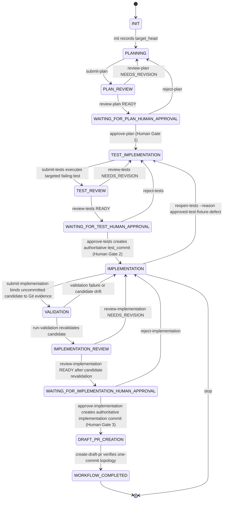

# ChessEcho issue workflow

This repository uses a minimal, file-based issue workflow in `scripts/agent_workflow.py`.

## Roles

- **Planner** (`chess-echo-planner`): writes the implementation plan using read-only tools.
- **Reviewer** (`chess-echo-reviewer`): read-only gate review, no test execution, includes incremental review.
- **Test implementer** (`chess-echo-test-implementer`): writes tests before production changes.
- **Implementer** (`chess-echo-implementer`): writes production changes and runs validation.

## Storage

Each issue run lives in:

```text
.agent-workflow/runs/issue-<number>/
```

with:
- `state.json` (current gate state)
- `artifacts/` (plan/review/report files)

Artifact source files supplied with `--artifact` must be staged outside the Git
worktree (for example, in the session's attachment or temporary artifact
directory). The coordinator copies them into the run-local `artifacts/`
directory; leaving a source staging directory such as `artifacts-src/` in the
worktree makes the required clean-worktree gate fail.

## Gate sequence

1. `init`
2. `submit-plan --scope PATH` -> `review-plan`
3. human `approve-plan`
4. `submit-tests --failure-command "COMMAND" --failure-contains "EXPECTED"` -> `review-tests`
5. human `approve-tests`
6. `submit-implementation --evidence PATH`
7. `run-validation`
8. `review-implementation`
9. `create-draft-pr`

At each human gate, approval requires the exact confirmation phrase from `.github/agent-workflow.json`.

When plan review reaches `WAITING_FOR_PLAN_HUMAN_APPROVAL`, `review-plan`
prints the exact submitted plan, the exact read-only review, the required
approval command, and an explicit stopped-at-gate message. No approval is
inferred or generated automatically.



Tests are committed before production code so the behavior contract is independently reviewable.
`approve-tests` creates the authoritative `test_commit`, and later stages enforce that approved tests
remain byte-for-byte unchanged. Production implementation remains an uncommitted candidate until Human
Gate 3. `submit-implementation` independently compares the current native Git candidate diff with the
submitted execution evidence, records the accepted candidate, and validation, implementation review, and
implementation approval each recompute that Git candidate before advancing.

The workflow records `target_head` from the configured PR target branch at `init` and requires the
worktree `HEAD` to match it, so pre-existing branch commits cannot be absorbed into a run. Immediately
before implementation approval and draft PR creation, the workflow fetches the target branch and fails
closed if it advanced. `approve-implementation` creates the single authoritative implementation commit
directly on `target_head`; `create-draft-pr` verifies that the final branch has exactly one commit, that
`HEAD^` is the target, and that changed paths remain within the approved scope. `create-draft-pr` is a
workflow action, not a human approval gate. PR review, CI, and merge remain external GitHub processes.

There is no `approve-pr`, `reject-pr`, `WAITING_FOR_PR`, or `PR_APPROVED` state. The exceptional
`reopen-tests --reason approved-test-fixture-defect` transition exists only to recover from a proven
approved-test fixture defect before implementation approval or draft PR creation; it preserves any
uncommitted production candidate and requires Human Gate 2 to run again.

The local approval command records the supplied human identity but cannot authenticate an arbitrary
`--by` value by itself. Operators must run approval commands as the human decision-maker; GitHub remains
the authoritative approval and merge system. Adding a second approval protocol would duplicate that
authority rather than improve it.

## Bounded execution

All external commands run via `scripts/workflow_supervisor.py` with configured timeout, grace period, and output caps.
Normal repository CI remains the broad validation authority; local checks are targeted to avoid reproducing CI.

## Commands

```bash
python3 scripts/agent_workflow.py init ISSUE
python3 scripts/agent_workflow.py status ISSUE
python3 scripts/agent_workflow.py submit-plan ISSUE --artifact PATH --agent chess-echo-planner
python3 scripts/agent_workflow.py review-plan ISSUE --status READY_FOR_HUMAN_APPROVAL|NEEDS_REVISION --artifact PATH --reviewer chess-echo-reviewer
python3 scripts/agent_workflow.py approve-plan ISSUE --by LOGIN --confirm plan_approved
python3 scripts/agent_workflow.py reject-plan ISSUE --by LOGIN --reason "..."
python3 scripts/agent_workflow.py submit-tests ISSUE --artifact PATH --agent chess-echo-test-implementer --failure-command "COMMAND" --failure-contains "EXPECTED"
python3 scripts/agent_workflow.py review-tests ISSUE --status READY_FOR_HUMAN_APPROVAL|NEEDS_REVISION --artifact PATH --reviewer chess-echo-reviewer
python3 scripts/agent_workflow.py approve-tests ISSUE --by LOGIN --confirm tests_approved
python3 scripts/agent_workflow.py reject-tests ISSUE --by LOGIN --reason "..."
python3 scripts/agent_workflow.py reopen-tests ISSUE --reason approved-test-fixture-defect
python3 scripts/agent_workflow.py submit-implementation ISSUE --artifact PATH --agent chess-echo-implementer --evidence PATH
python3 scripts/agent_workflow.py run-validation ISSUE --profile PROFILE
python3 scripts/agent_workflow.py review-implementation ISSUE --status READY_FOR_HUMAN_APPROVAL|NEEDS_REVISION --artifact PATH --reviewer chess-echo-reviewer
python3 scripts/agent_workflow.py approve-implementation ISSUE --by LOGIN --confirm implementation_approved
python3 scripts/agent_workflow.py reject-implementation ISSUE --by LOGIN --reason "..."
python3 scripts/agent_workflow.py create-draft-pr ISSUE --title "..." --body-file PATH
```

`create-draft-pr` enforces the PR body section headings: `## What`, `## Why`, `## Testing`.
